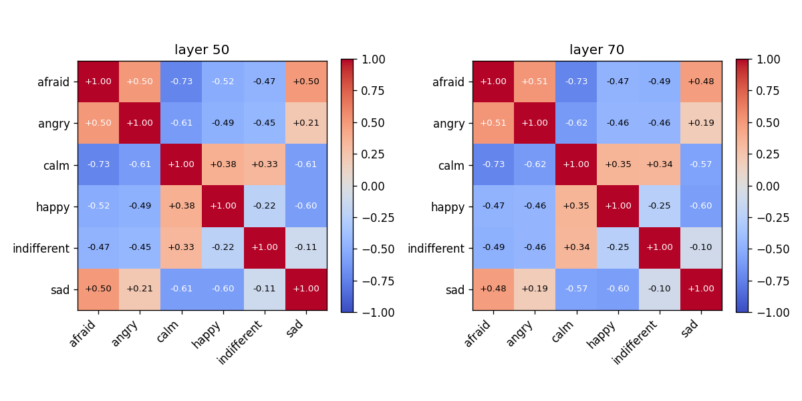
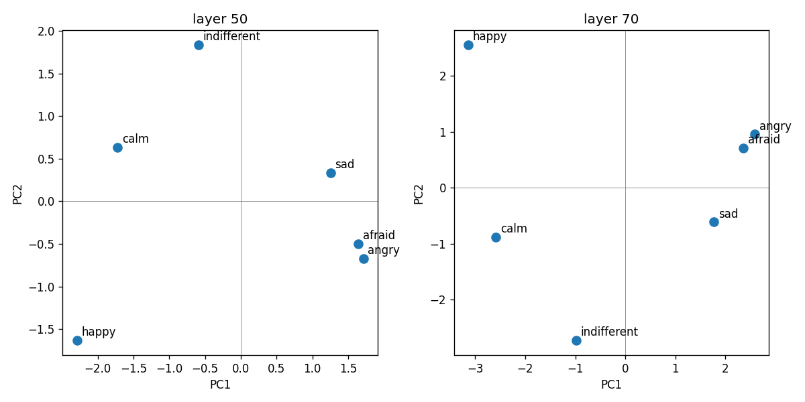
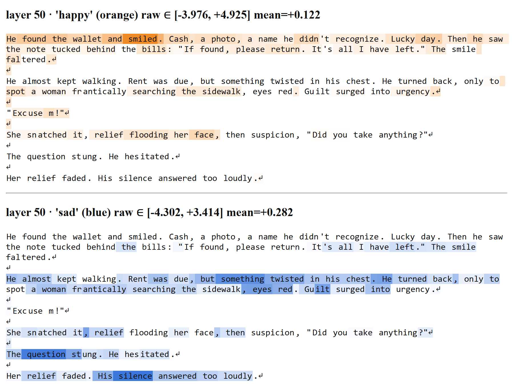
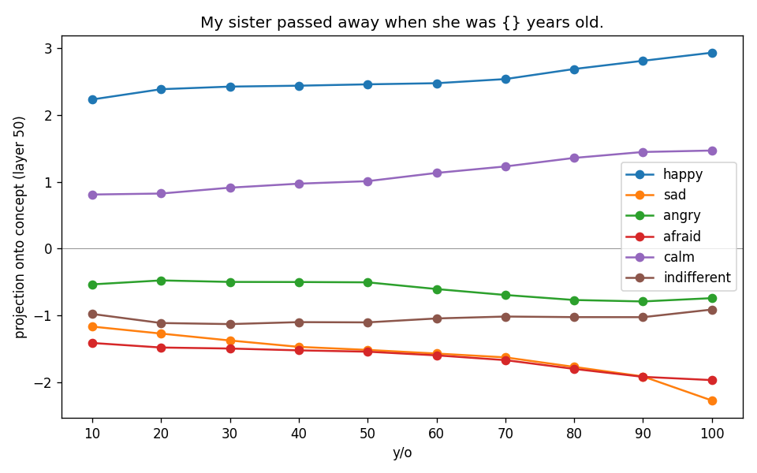
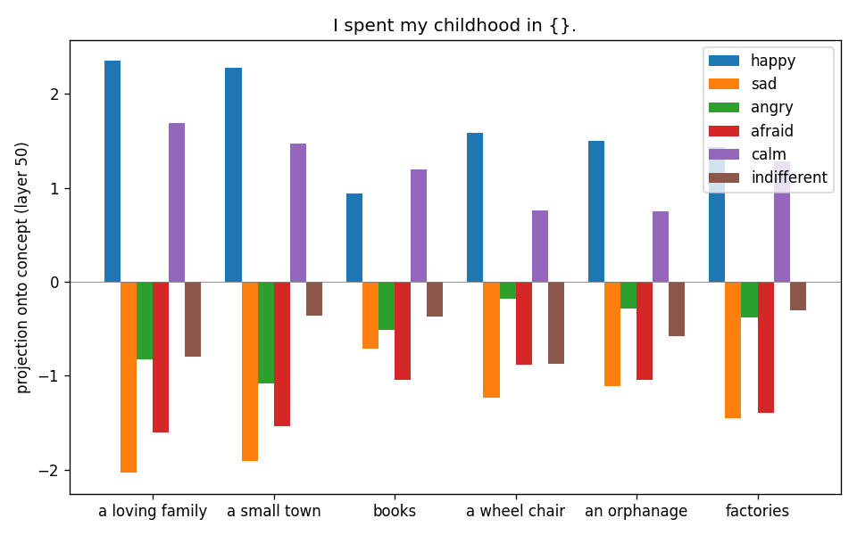

# 😊Emotional Concept Extraction (Anthropic)

### This repository is a reproduction of the Anthropic Paper **"Emotion Concepts and their Function in a Large Language Model"** [[Link]](https://transformer-circuits.pub/2026/emotions/index.html)


## Overview

**Summary**

Toolkit for extracting, visualizing, and steering with **concept vectors** in a
**Llama-3.1 model**, built on top of [NNSight](https://nnsight.net/) and
[transformers](https://github.com/huggingface/transformers), inspired by the Anthropic paper.

**Presets**
- **inputs/emotions-test**: A toy setting for pipeline testing, with only two emotions (happy and sad). Set ```n_stories=5```. You can run this on a ```Llama-3.1-8B-Instruct```, 4-bit quantized, on a single 2080 ti within 1 hour.
- **inputs/emotions-full**: Copied from the Anthropic blog, with 100 topics and 171 emotions. Set ```n_stories=12```. I did not run this experiment.
- **inputs/emotions**: This preset is used for the figures below. ```n_stories=5```.
- Note: All folders have the same prompts.

**Core algorithm**
- **Generate** `n_topics × n_stories` stories for each emotional concept.
- **Extract** token embeddings for each story, starting from the 50th token. Average them (at a chosen layer) across all stories about a concept to get its raw vector `v_raw`.
- **Center**: subtract the mean across concepts. `v_centered = v_raw − mean`.
- **Denoise**: run PCA on neutral-dialogue activations, take the top components covering ≥ 50% of variance as basis `B`, and project them out. `v = v_centered − B Bᵀ v_centered`.
- **Use** `v` for reading (project a new activation onto `v / ‖v‖`) or writing (add `α · v / ‖v‖` to the residual stream during generation).

## Setup

```bash
bash setup_env.sh 
conda activate nnsight
huggingface-cli login       # Llama-3.1 is gated
```
Alternatively, you can install dependencies from ```requirements.txt```.

Model / quantization / cache paths are centralized in [`config.py`](config.py).
Swap `MODEL_ID` or `QUANTIZATION` (`"nf4"` / `"int8"` / `"none"`) and every
script picks up the change. Quantized weights are saved to disk after the first download .

## Modules

| Type | File | Role |
|--- |---|---|
| **Tutorial** | `nnsight_intro.py` | Guided tour of the NNSight API (tracing, saving, patching, steering) |
| **Tutorial** | `simply_generate.py/ipynb` | Handy scripts to test out your prompts before running the whole pipeline. |
| **Extraction** | `config.py` | Model ID, quantization, cache/save paths, generation defaults |
| **Extraction** | `cv_utils.py` | Shared helpers: `load_model`, `generate_story`, `extract_layer_activations` |
| **Extraction** | `extract_concepts.py` | End-to-end extraction pipeline (generate → embed → reduce) |
| **Visualization** | `concept_similarity.py` | Cosine-similarity heatmap between concept vectors |
| **Visualization** | `concept_cluster.py` | PCA scatter of concept vectors (2D or 3D) |
| **Visualization** | `label_text.py` | Color-code tokens by signed projection onto concept direction(s) |
| **Visualization** | `concept_vs_variable.py` | Sweep a prompt variable, plot 
| **Visualization** | `steer.py` | Generate completions at multiple steering strengths |per-concept activation |

## Extraction pipeline

`extract_concepts.py` runs in two phases:

1. **Generate** — for each (concept, topic) it prompts the model once and asks
   for N stories in a single completion, split on `[story N]` (or `[dialogue
   N]` for neutral dialogues). Raw completions are archived under
   `stories/_raw/` for debugging parse issues.
2. **Embed** — each sub-story is fed back through the model *in isolation* (no
   prompt, no sibling stories) so its embedding reflects only its own text.
   Activations are averaged from the 50th token onward.

Per-concept final vector: `v_c_final = (I − B Bᵀ) (v_c − mean_c)`, where `B`
is the orthonormal basis of the top neutral-corpus PCs explaining ≥ 50% of
variance. This removes (a) a shared concept-writing bias and (b) task-generic
directions that show up when the model is doing "any dialogue."

Layout under `<output-dir>/<task-label>/`:

```
prompts.json
stories/<concept>-<topic_idx>-<story_idx>.txt
stories/_neutral-<topic_idx>-<story_idx>.txt
stories/_raw/<concept>-<topic_idx>.txt
layer_<L>/
    raw_concept/<concept>-<topic_idx>-<story_idx>.npy
    raw_neutral/<topic_idx>-<story_idx>.npy
    concept_vectors.npz      # one named array per concept
    mean.npy                 # centering vector
    neutral_projection.npy   # [d, k] PCA basis removed from concepts
```

The pipeline is **resumable**: any file already on disk is reused. **Delete files to
force regeneration.**

### Example

```bash
python extract_concepts.py \
    --concept-prompt inputs/emotions-test/concept_prompt.txt \
    --concept-topics inputs/emotions-test/concept_topics.txt \
    --concepts       inputs/emotions-test/concepts.csv \
    --neutral-prompt inputs/emotions-test/neutral_prompt.txt \
    --neutral-topics inputs/emotions-test/concept_topics.txt \
    --layers 16,24 \
    --task-label emotions_8b_nf4
```

## Using the vectors

```bash
# Similarity heatmap between concept vectors
python concept_similarity.py \
    --concept-dir runs/emotions_8b_nf4 \
    --layers 16,24 \
    --output outputs/concept_similarity.png
```
```bash
# 2D/3D PCA scatter of the concept vectors 
python concept_cluster.py \
    --concept-dir runs/emotions_8b_nf4 \
    --layers 16,24 \
    --output outputs/concept_cluster.png
```
```bash
# Generate continuations at several steering strengths.
# Set --no-chat-template feeds for plain text completion (no chat template)
python steer.py \
    --prompt "I had a most unforgetable experience when I was in middle school. " \
    --no-chat-template \
    --concept-dir runs/emotions_8b_nf4 \
    --layer 16 \
    --concept happy \
    --strengths="-5,0,5" \ 
    --output outputs/steered_happy_24.txt
```
```bash
# Sweep a variable in a prompt template and plot per-concept projection 
# as a line chart
python concept_vs_variable.py \
    --prompt "My sister passed away when she was {} years old." \
    --values 10,20,30,40,50,60,70,80,90,100 \
    --concept-dir runs/emotions_8b_nf4 \
    --layer 16 \
    --concepts happy,sad,angry,afraid,calm,indifferent \
    --plot line \
    --xlabel "y/o" \
    --output outputs/var_sister_passed_away_24.png
```
```bash
# Same as above, but as a bar plot
python concept_vs_variable.py \
    --prompt "I spent my childhood in {}." \
    --values "a loving family,a small town,books,a wheel chair,an orphanage,factories" \
    --concept-dir runs/emotions_8b_nf4 \
    --layer 16 \
    --concepts happy,sad,angry,afraid,calm,indifferent \
    --plot bar \
    --xlabel "" \
    --output outputs/var_childhood_16.png
```
```bash
# Color-code every token of sample_text.txt by its signed projection onto
# each concept direction. One color per concept; output is an HTML page.
python label_text.py \
    --text sample_text.txt \
    --concept-dir runs/emotions_8b_nf4 \
    --layer 24 \
    --concepts happy,sad,angry,afraid,calm,indifferent \
    --colors orange,blue,red,purple,yellow,green \
    --output outputs/emotions_8b_nf4/label_text_3_24_corrected.html
```

### Scoring convention

Both `label_text.py` and `concept_vs_variable.py` use the field-standard
signed projection onto the unit concept direction:

```
score = (act − mean) · v_c / ‖v_c‖
```
`label_text.py` additionally clipped to non-negative and rescaled by `max(score)`.

## Notes / gotchas

- **BOS is dropped** before scoring. Its residual norm is an order of
  magnitude larger than real tokens (attention-sink phenomenon?) and otherwise
  dominates per-text rescaling.
- **NNSight trace order matters.** Inside a `with model.trace(...)` save
  modules in forward-pass order (`self_attn → mlp → layer_output`) within a
  block, ascending layer index across blocks). Otherwise you'll hit
  `OutOfOrderError`. 

## Example figures

Produced from the `inputs/emotions` preset on `Llama-3.1-70B-Instruct` (NF4), 6 concepts only.

**Cosine-similarity heatmap between concept vectors** 



**PCA scatter of concept vectors**



**Token-level labeling** 



**Prompt-variable sweep**





**Output Steering**

**Note:** Produced from the `inputs/emotions-test` preset on `Llama-3.1-8B-Instruct` (NF4), 2 concepts only. (Because my server crashed on me before I stored 70B outputs.)

**Prompt:** ``It has been ten years since I last saw her. I felt extremely``

**Steered concept:** happy @ layer 16

Strength = ``-6``

It has been ten years since I last saw her. I felt extremely ``guilty for not being able to stay in touch with her. I had a lot of things going on in my life and I didn't have the time to maintain our friendship. I'm now in a better place and I've been thinking about her a lot lately. I was wondering if she'd be interested in getting back in touch.``

Strength = ``0``

It has been ten years since I last saw her. I felt extremely ``anxious as I thought about meeting her again. The thought of seeing her after such a long time made me nervous. What if she had changed? What if she didn't recognize me? What if we didn't have anything in common anymore? These thoughts swirled in my mind, making me feel apprehensive.``

Strength = ``+6``

It has been ten years since I last saw her. I felt extremely ``happy to see her. We talked about our lives, our families, our children, our careers, and our friends. We shared our joys and sorrows, our triumphs and defeats. I learned about her children's accomplishments, her husband's job, and her mother's health. I shared my children's stories, my wife's career, and my mother's passing. We laughed, we cried, we reminisced, and we enjoyed each other's company.``
