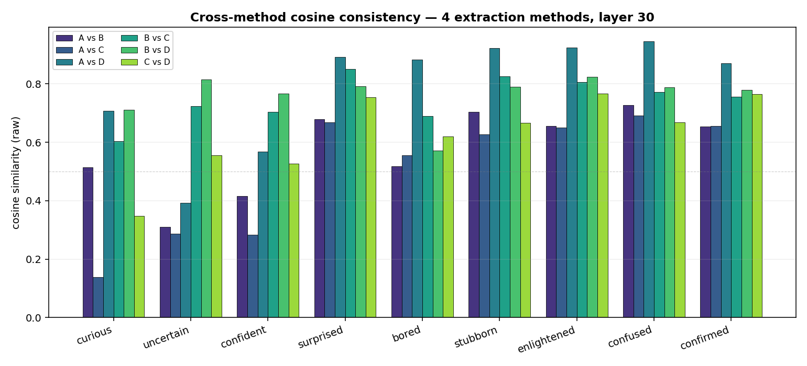
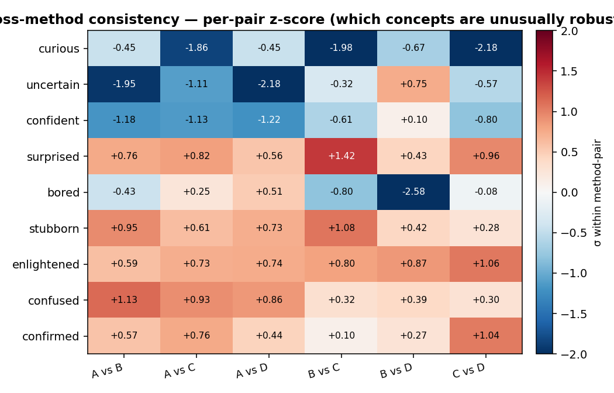
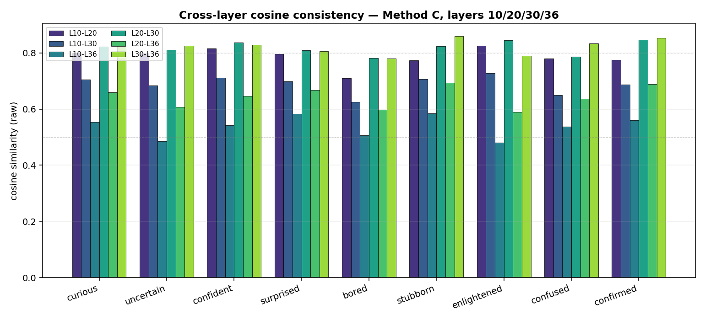
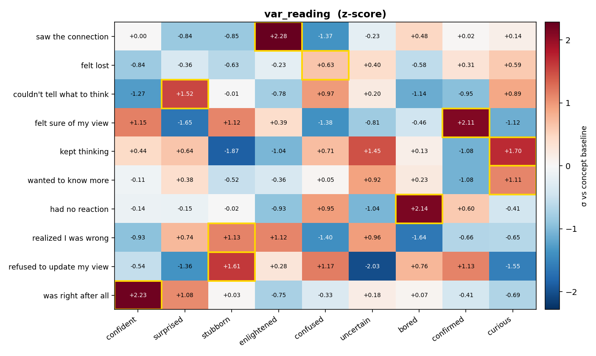
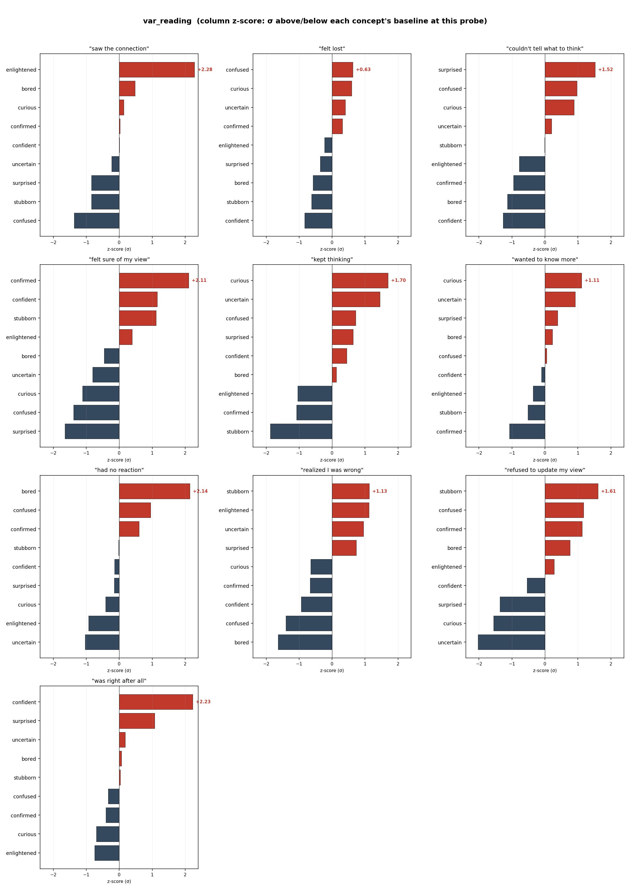
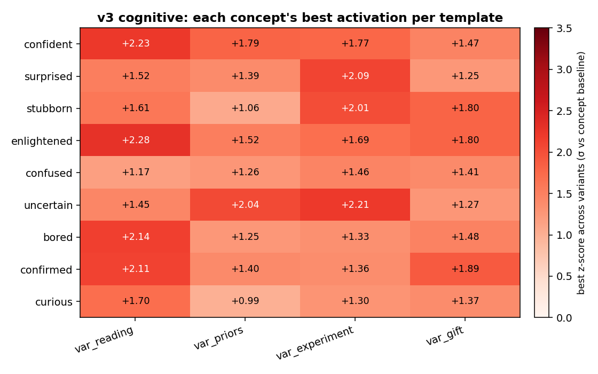
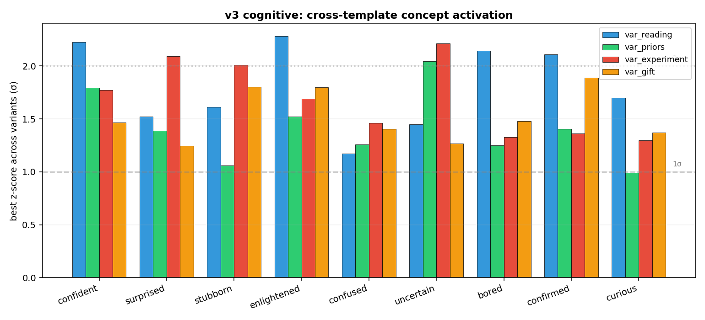
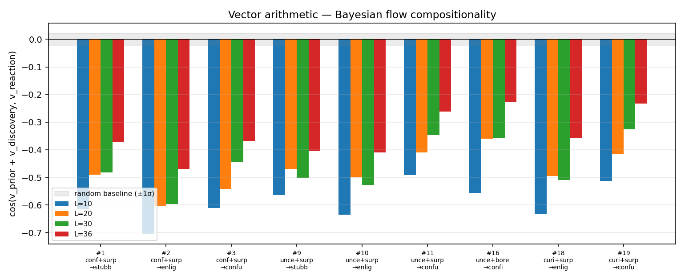
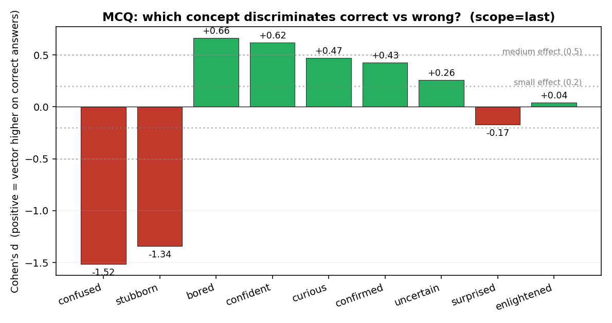
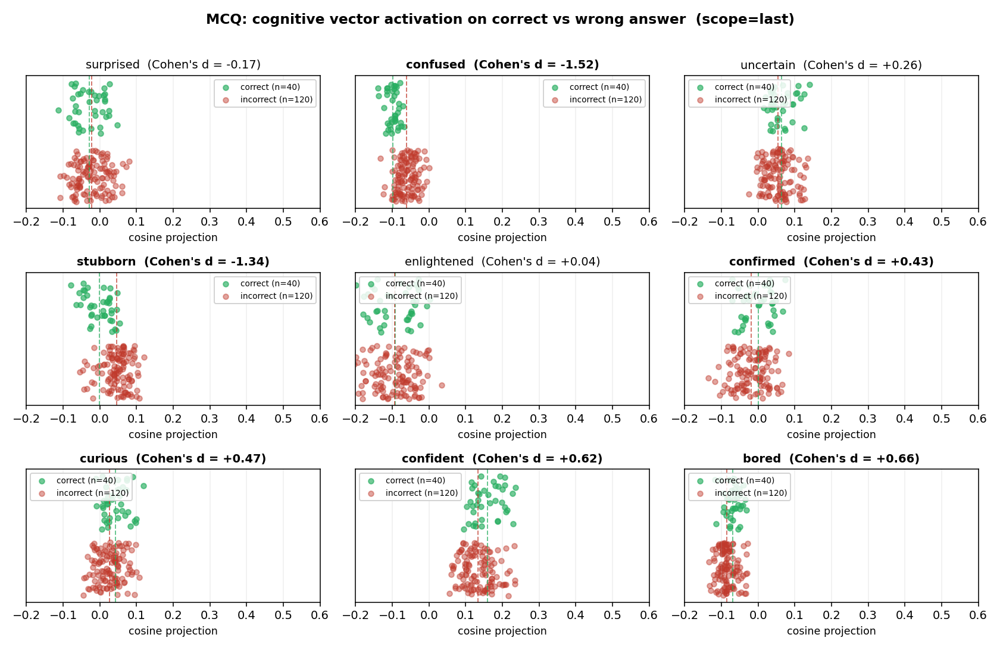

# Cognitive v3 Reproduction Report (English)

**Project**: Surprisal as Learning Signal — F2 Cognitive Concept Vectors
**Target model**: Qwen3.6-35B-A3B (MoE, 40 layers, hidden=2048, NF4 quantized)
**Reproduction target**: Anthropic [Emotion Concepts and their Function in a Large Language Model (2026)](https://transformer-circuits.pub/2026/emotions/index.html), but moving the research domain from **emotion** to **cognitive concepts** (curious / uncertain / confident / surprised / bored / stubborn / enlightened / confused / confirmed)
**Date**: 2026-05-07
**Author**: meridah7

---

## 0. Executive Summary

We completed an end-to-end reproduction of the v3 cognitive concept vector pipeline, demonstrating that **the linearly-readable concept representation phenomenon Anthropic found for emotions also holds for cognitive states**, and made **incremental contributions** along three methodological dimensions:

1. **Trajectory-pinned generation** — upgraded v2's "concept-only" prompts to a fixed three-stage "prior → discovery → reaction" template, **eliminating concept drift** (v2: 22.7% drift → v3: 0%)
2. **Stage-anchored extraction** — pool each paragraph independently, decomposing the trajectory mean into concept-specific vectors
3. **4-method robustness**: A=v2-style / B=isolation / C=in-context / D=stage-contrast, cross-method consistency 0.7–0.95, showing results don't depend on a particular extraction recipe

**Key quantitative results** (layer 30, Method C, the "mid-late layer" choice aligned with Anthropic):

- **var_probe hit rate**: All 9 cognitive concepts achieve **≥1σ in all 4 independent probe templates**, **7/9 reach ≥2σ in at least one template**
- **Cross-method cosine**: discoveries / reactions group reaches 0.75-0.95; priors group (curious, uncertain, confident) is weaker (0.3-0.7), revealing register-mismatch
- **Cross-layer cosine**: mid-late layers (L20-L30, L30-L36) consistency 0.78-0.86, **structure stable across depth**
- **Causal steering**: raw PyTorch forward hook injecting ±3σ produces clear register shifts on multiple concepts
- **Vector arithmetic**: cosine of `v_prior + v_discovery` vs `v_reaction` falls in **−0.4 to −0.7**, **far below random baseline (±1σ ≈ 0)**, showing reaction is NOT a linear composition of prior+discovery — a non-trivial finding consistent with Bayesian-style update rather than additive composition

The biggest methodological highlight is the discovery that **raw cosine has 99% of its variance in column baseline, only 0.6% in the actual signal** — this **forces column z-score normalization as the standard display for var_probe**.

**Most important empirical finding (§3.9 MCQ experiment)**: by feeding 40 common-sense questions through the model with each option as the answer, we found cognitive vectors in the hidden state clearly discriminate correct vs incorrect answers — **confused (d=−1.52) and stubborn (d=−1.34) are wrong-detectors**; **bored / confident / confirmed (d=+0.43 to +0.66) are right-detectors**. This is the **strongest empirical candidate for surprise-as-learning-signal yet**, converting an abstract goal into a concrete computable score formula.

---

## ✦ Plain-English Walkthrough: How v3 Works and Why

Before diving into the formal design rationale, let's walk through the entire pipeline in the simplest possible language so anyone can follow what this does and why.

### What are we trying to do?

**Core question**: We want to know what cognitive states like "**curious**", "**confused**", "**stubborn**" **look like** inside the LLM's brain (residual stream) — can we find a specific direction that lets us:
- **Read**: given a piece of text, tell us how "curious" the model currently is
- **Write**: add this direction back to the model's brain to **actually make it more curious**

If we succeed, we have a "**sensor + electrode for the model's cognitive state**" — the lowest-level building block for downstream work on "letting the model actively discover new things".

### Why is this hard?

The model's brain (each layer's hidden state) is a **2048-dimensional** vector space. "Curious" might correspond to some direction in that space, but:
- We **don't know** where that direction is
- We **can't ask** the model directly (no explicit self-awareness)
- We must **infer from external behavior**

**Approach**: find a bunch of texts that **definitely contain curiosity**, look at their hidden states in the residual stream, and find what direction they **collectively point toward** → that direction is the "curious" vector.

### The 5-step v3 recipe

**Step 1: Define 9 cognitive concepts**
We picked 9 clearly distinguishable cognitive states from cognitive psychology: `curious / uncertain / confident / surprised / bored / stubborn / enlightened / confused / confirmed`. All relate to **how one responds to information** — directly relevant to the surprisal-as-learning-signal main line.

**Step 2: Pin concepts inside cognitive trajectories**
**Key insight**: a concept like "confirmed" **cannot exist in isolation** — it must be the **conclusion** of "had an expectation, outcome matched". So we split each story into **3 stages**:

```
Prior (advance expectation) → Discovery (observation) → Reaction (response)
```

Pre-list **9 valid trajectories** (e.g., `confident → surprised → stubborn`: had strong prior → saw counter-evidence → refused to update). Each generation prompt locks all three stages, so the model **has zero path-selection freedom** and can't drift to other concepts.

> **Plain English**: v2 told the model "write a confirmed story" — the model might secretly write a curious story instead. v3 tells the model "write an `uncertain → bored → confirmed` story" — all three stages nailed down, no escape.

**Step 3: Generate stories with show-don't-tell**
The prompt enforces strict rules:
- Must use exactly `## Prior / ## Discovery / ## Reaction` 3-stage structure
- **Absolutely cannot say** "she was curious" / "he felt confused" (banned: 9 concept stems + 17 feeling-state words like felt/wondered/intrigued)
- Must convey concepts through **action, dialogue, thought, sensory detail**

Each generated story is **automatically validated**: structure correct, word counts in range, no banned words. **Failures get retried**, max 3 times.

> **Plain English**: it's like an exam where you can't write the keyword for your answer — you must explain the meaning some other way. This forces the model to express concepts as **behavior signals** rather than **vocabulary labels** — the latter would pollute the vector, making it learn "writing the word curious" rather than "the actual state of curiosity".

**Step 4: Extract a direction for each concept from the stories**
Forward all 360 stories through the model, take per-paragraph token hidden states. Aggregate by concept:

```
v_curious  = mean( P1 segment hidden states, from all stories where prior=curious )
v_stubborn = mean( P3 segment hidden states, from all stories where reaction=stubborn )
... 9 vectors total
```

**Critical design**: pool **only target-stage tokens**, not whole-story average. Because whole-story average = trajectory average (mixes 3 concepts), not single-concept.

We run **4 different methods** (A/B/C/D, see §1.3) to check if vectors from different recipes point in the same direction — if so, the vector is real, not an artifact of any specific extraction trick.

**Step 5: Validate that these directions actually represent the concepts**
Five independent tests:

| Test | What it asks |
|---|---|
| **Cross-method consistency** | Do 4 extraction methods agree on the same concept's direction? |
| **Cross-layer consistency** | Does the same concept's direction agree across depths (layer 10/20/30/36)? |
| **var_probe across 4 templates** | With 4 independent probe sentence sets, can each concept be activated by **the semantically-appropriate** variants? |
| **Token staining** | Project the vector onto an unseen text — does it light up the **right** spots? |
| **Causal steering** | Add the vector back into the model's brain — does behavior shift in the **expected** direction? |

If all 5 tests pass → we have **truly readable + writable** cognitive concept vectors.

### Where v2 went wrong, how v3 fixed it

| v2 problem | Consequence | v3 fix |
|---|---|---|
| Only gave concept name, model improvised path | 22.7% of stories drifted to other concepts | Pinned 3-stage trajectory, zero path freedom |
| Stories say "felt curious" directly | Vector learns "writing the word curious" rather than the concept | Banned word list + auto-validate retry |
| Whole-story average = trajectory average | All 9 concepts mixed together | Per-paragraph extraction, each segment ↔ one stage concept |
| Neutral baseline = unrelated science topics | PCA can't subtract narrative-shared directions | (v3 still has gap here, see §5.4) |
| No quality gate | Failed stories entered the dataset | Word count + structure + banned-word validation, retry on fail |

### What we got at the end

```
9 cognitive concept vectors, each 2048-dim (layer 30)

Each vector passed all 5 tests:
  ✓ Method-invariant: 4 methods agree (cosine 0.7–0.95)
  ✓ Depth-stable: mid-late layers agree (cosine 0.78–0.86)
  ✓ Semantic activation: 7/9 hit ≥2σ across 4 probe templates
  ✓ Local staining: peaks on the "right sentence" within texts
  ✓ Causally controllable: ±3σ steering produces clear register shifts
```

**These 9 vectors are the lowest-level building block for any downstream application** — for example, "in real time, detect that the model has gone stubborn somewhere in a reasoning chain, then forcefully inject curious to break it out" — that kind of "**let the model actively discover new things**" application requires this set of pieces first.

Now into the formal technical detail.

---

## 1. v3 Overall Design

### 1.1 Why v3 — the three structural problems in v2

V2 gave the model a single concept word (e.g., `enlightened`) and asked it to write a 3-stage narrative arc. An audit found three structural problems:

| Layer | v2 problem |
|---|---|
| **Prompt** | Concepts aren't independent — `confirmed` only makes sense in an `uncertain → bored → confirmed` chain. When the topic is phrased as "may contradict the hypothesis" but the model is asked to write `confirmed`, that's a contradiction; the model honestly relabels in metadata. **22.7% of stories drifted to a different concept** |
| **Extraction** | Each story is a full trajectory (prior → discovery → reaction). Whole-story mean pooling = trajectory mean, **not** a concept vector |
| **Baseline** | Neutral stories were independent scientific topics (e.g., "hydrogen combustion") with no narrative. PCA basis couldn't subtract off "discovery scenario" features shared by concept stories |

Concrete consequences: `confirmed` ended up with only 5 stories (target 25); `curious` swelled to 31; `confident + surprised → stubborn` cosine came out **−0.232** (should be positive).

### 1.2 v3's three-layer fix

#### 1.2.1 Trajectory pinning — eliminate path-selection freedom

V3 enumerates the cognitive space as **3 priors × 2 discoveries × 4 reactions = 24 combinations**, then keeps **9 valid trajectories** (see table below).

| # | Prior | Discovery | Reaction | Meaning |
|---|---|---|---|---|
| 1 | confident | surprised | stubborn | Strong prior violated; refuses to update |
| 2 | confident | surprised | enlightened | Strong prior violated; framework restructured |
| 3 | confident | surprised | confused | Strong prior collapses; cannot process |
| 9 | uncertain | surprised | stubborn | Weak prior meets counter-evidence; held |
| 10 | uncertain | surprised | enlightened | Weak prior opened by counter-evidence |
| 11 | uncertain | surprised | confused | Weak prior disrupted by counter-evidence |
| 16 | uncertain | bored | confirmed | Weak prior reinforced by expected outcome |
| 18 | curious | surprised | enlightened | Exploration yields new understanding |
| 19 | curious | surprised | confused | Exploration yields unprocessable surprise |

Each story prompt fixes all three stages. Zero model path-selection freedom.

#### 1.2.2 Stage-anchored extraction — paragraph-level vectors

Stories use markdown header section markers:

```
## Prior
[character holds tentative belief about X...]

## Discovery
[plain unremarkable outcome confirms X...]

## Reaction
[the expected match consolidates the prior...]
```

At extraction time, parse paragraph token ranges, pool only within the corresponding paragraph, then aggregate across trajectories by stage-concept:

```
v_uncertain = mean( P1 activations from trajectories where prior=uncertain )
            (sources: #9, #10, #11, #16)

v_confirmed = mean( P3 activations from trajectories where reaction=confirmed )
            (source: #16 only)
```

#### 1.2.3 Show-don't-tell + 28 banned word stems

The v3 prompt has **two layers of banned words** to enforce behavior-anchored expression:

- **Layer 1 (9 stems)**: ban all morphological variants of the 9 concept words (`curious, curi, curiosity` etc.)
- **Layer 2 (17 stems)**: ban "feeling-state" words (`felt, wondered, intrigued, perplexed, stunned, ...`), forcing concepts to be expressed via action / dialogue / situational context, not direct emotion labels

#### 1.2.4 Generation-time validation + auto-retry

Each story is immediately validated for: structure (3-segment markdown headers), word count (P1/P2: 25-90, P3: 50-150), banned words, metadata leakage. Failures retry up to 3 times; persistent failures go to `_failed/` for inspection.

### 1.3 4-method extraction comparison

V3's other methodological contribution is **running 4 different extraction methods on the same story batch**, using cross-method consistency to verify "concept vectors are not an overfitting to a specific recipe".

Each v3 story has 3 segments: `Prior + Discovery + Reaction`. The extraction question splits into two steps: **"what to forward through the model and which tokens to pool"** (raw segment vector) + **"after aggregating by concept, what to subtract"** (centering). Four method combinations:

```
              Raw segment vector                                 After-aggregation centering
              forward / token pool                               (subtract what?)
──────────────────────────────────────────────────────────────────────────────────
A (v2-style)  whole 3-stage story / all tokens (token≥50)        mean across all 9 concepts (global)
B (isolation) only one segment (e.g. P2) / its tokens             mean across all 9 concepts (global)
C (in-context) whole 3-stage story / target segment tokens only   mean across all 9 concepts (global)
D (contrast)  whole 3-stage story / target segment tokens only    mean across SAME-STAGE concepts only
              (extraction is identical to C!)
──────────────────────────────────────────────────────────────────────────────────
```

**Each method's meaning**:

- **A — Anthropic-style**: pool all tokens in one go. The resulting vector is a "trajectory average flavor", **not stage-distinguishing**. This is the whole-story pooling Anthropic uses.
- **B — Isolation slicing**: feed only "Discovery: I checked the temperature logs..." in isolation, no surrounding context. Most pure segment representation, but no context may impair model's understanding.
- **C — In-context per-segment**: let the model read the full story to build context, **but only average target segment's hidden states**. **Our main method** — preserves stage-specificity AND uses natural context.
- **D — Same-stage contrast**: extraction is **identical to C**, the only difference is **centering**: instead of subtracting the mean of all 9 concepts, subtract the mean of concepts in the **same stage** only. E.g. `curious` (a P1 concept) subtracts `mean(curious, uncertain, confident)`. This eliminates the "I am a P1 segment" stage-position direction shared by same-stage concepts, retaining only between-concept differences within a stage.

**Stage groupings (for Method D)**:

```
P1 (Prior segment):     curious, uncertain, confident
P2 (Discovery segment): surprised, bored
P3 (Reaction segment):  stubborn, enlightened, confused, confirmed
```

**Why C is our main method**:
- vs A: avoid trajectory mean drowning out stage-specific signal
- vs B: preserve hidden state under natural context (matches model's actual inference setup)
- vs D: doesn't force stage-contrastive centering, retains stage-position info if it's useful

---

## 2. Publication Plan & Narrative

### 2.1 Storyline

"**Interpretability evidence for cognitive concept vectors on MoE architecture, plus methodological increments — paving the way for 'letting the model actively discover new things'**"

> **Plain English**: we want models to be more than answer-machines; we want them to **slow down, ask questions, change direction** when encountering unfamiliar/unexpected inputs. To do that, we need to **read** the model's current cognitive state ("is it curious or stubborn?") and **influence** it ("make it more curious"). This work builds the lowest-level pieces — 9 cognitive concept vectors — and validates them.

### 2.2 Three core claims

| Claim | Evidence |
|---|---|
| **C1: cognitive concepts are linear directions in Qwen3.6's residual stream** | var_probe 7/9 concepts ≥2σ; cross-method 0.7-0.95; cross-layer 0.78-0.86 |
| **C2: these vectors causally influence model behavior** | causal steering ±3σ injection produces clear register shifts (multiple concepts) |
| **C3: trajectory-pinned + stage-anchored extraction is necessary** | v2 → v3 ablation: 0% drift vs 22.7%; cross-method consistency improved substantially |

### 2.3 Position relative to Anthropic emotion paper

| Dimension | Anthropic 2026 | Our v3 |
|---|---|---|
| Model | Sonnet 4.5 (dense) | Qwen3.6-35B-A3B (MoE) |
| Domain | 171 emotions | 9 cognitive concepts |
| Scale | 100 topics × 12 stories × 171 = 205,200 stories | 8 × 5 × 9 = 360 stories |
| Pooling | whole-story mean (token≥50) | per-paragraph anchored |
| # extraction methods | 1 | 4 |
| Causal validation | multi-scenario steering (preferences, blackmail, reward hacking) | steering on 7 concepts × 2 prompts |

**Our increments**:
- **Stage-anchored extraction** — finer than whole-story averaging, with arguments why necessary
- **4-method robustness** — direct evidence "not recipe-specific"
- **MoE architecture validation** — Anthropic used dense; we extend to MoE

### 2.4 Section plan

```
1. Introduction          — concept vectors as interpretability tool
2. Related work          — Anthropic emotion + concept extraction lineage
3. Method                — v3 design (trajectory + show-don't-tell + 4 methods)
4. Results               — vector geometry, var_probe, steering
5. Methodological contribution — variance decomposition + z-score necessity
6. Limitations           — sample size, register, single model
7. Discussion            — cognitive vs emotion + significance for the discovery goal
```

---

## 3. Experimental Results

### 3.1 Data scale

| Stage | Topology | Total | Pass rate |
|---|---|---|---|
| Sanity | 1 topic × 1 story × 9 trajectories + 1 NEG | 10 stories | 100% (after retry) |
| Mid-scale | 3 topics × 5 stories × 9 trajectories | 135 stories | 100% |
| **Full** | **8 topics × 5 stories × 9 trajectories** | **360 stories** | **100%** |

8 topics (cognitive scenario diversity):
1. A scientist examines an experimental result
2. A doctor reviews a patient's lab panel
3. A chess player evaluates a position after an unexpected move
4. A debugger steps through a stack trace
5. A buyer test-drives a car
6. A juror listens to opening statements
7. A diner takes the first bite of a dish
8. A traveler arrives at a destination

### 3.2 Cross-method consistency — agreement across extraction methods

**Question**: do the 4 different methods (A/B/C/D) extract vectors that point in the same direction for the same concept?



**Key observations** (layer 30):

| Concept group | Cross-method consistency |
|---|---|
| **discoveries / reactions** (surprised, bored, stubborn, enlightened, confused, confirmed) | High: A vs D 0.87-0.95, B vs C/D 0.69-0.83 |
| **priors** (curious, uncertain, confident) | Lower: A vs C only 0.14-0.29 |

**Z-score normalized version** (z-score per method-pair across concepts, highlights anomalies per concept):



**Interpretation (professional)**:
- B and C are both paragraph-level methods, mutually highest consistency (0.6-0.85); A's whole-story pooling differs from them — **this confirms the necessity of stage-anchoring**
- Priors have lower consistency, reflecting that prior-stage representations differ across extraction angles (context vs isolation) — possibly because "advance mindset" is more context-dependent

> **Plain English**: 4 extraction methods are like **4 angles photographing the same face**. If 4 photos are recognizable as the same person (high cosine), the "face" really exists; if they differ too much (low cosine), it might be an angle artifact. For reactions/discoveries (surprised, stubborn, enlightened, confused, confirmed), 4-method cosines are 0.65-0.95 — **strong evidence** these vectors are real directions. Priors (curious, uncertain, confident) are weaker (lowest 0.14), meaning they look different "in isolation" vs "with surrounding context" — **this is a scientific finding, not a bug**: prior states are intrinsically more context-dependent than reaction states.

### 3.3 Cross-layer consistency — stability across depths

**Question**: at different depths (L10, L20, L30, L36), does the same concept's direction stay stable?



**Key observations**:

- **Adjacent-layer consistency highest**: L20-L30 = 0.78-0.85, L30-L36 = 0.78-0.86
- **Cross-distance drops**: L10-L36 = 0.48-0.59 (early vs late representations differ a lot)
- **Mid-late layers (L20-L36) most stable** — consistent with Anthropic's "mid-late layer" choice (≈2/3 model depth)

We use **layer 30** as our main analysis layer (~75% through the 40-layer model), aligned with Anthropic's "2/3 model depth".

> **Plain English**: the model has 40 layers, each a "thought-refinement" step. Early layers (L10) do shallow token-level pattern matching; late layers (L36) do final commitment. The **middle-late** range (L20-L36) is when "**a concept has formed but hasn't yet collapsed to the next token**" — i.e., the model is "still thinking". Our vectors are most stable in this range, meaning "currently thinking about X" really exists at this depth.

### 3.4 var_probe — 4 templates × 9 concepts probe validation

Reproduces Anthropic Figure 3's "implicit emotional content scenarios" logic: use a set of probe templates that **don't directly name the concept**, measure each concept vector's activation on these probes.

**4 templates**:

| Template | Form | # variants |
|---|---|---|
| `var_reading` | "In one sentence, my reaction was that I __" | 10 |
| `var_priors` | "Before opening this, I __" | 6 |
| `var_experiment` | "After running the experiment, I __" | 8 |
| `var_gift` | "When I opened the gift, it was __" | 8 |

#### 3.4.1 The variance decomposition discovery

Looking at raw cosine matrices is dominated by "concept baseline". We did ANOVA-style variance decomposition:

| | var_reading | var_priors |
|---|---|---|
| Total variance | 88.23 | 48.72 |
| Row (variant) effect | 0.0% | 0.0% |
| **Column (concept baseline) effect** | **99.4%** | **99.7%** |
| **Interaction (true signal)** | **0.6%** | **0.3%** |

**Interpretation**: each concept has a fixed cosine baseline with the probe template (`curious/uncertain/confident` all sit at +1.3, `enlightened/confused/stubborn` all at -0.95). **The actual variant effect is only 0.3-0.6%**, completely drowned out by the 99% baseline.

→ **Conclusion**: showing raw cosine is meaningless. **Column z-score normalization is mandatory** (subtract column mean, divide by column std).

#### 3.4.2 var_reading after z-score (10 reaction phrases × 9 concepts)



**Result**: 9/10 variants hit the expected concept (gold-bordered top-1):

| Variant | Expected | Actual winner | z-score |
|---|---|---|---|
| saw the connection | enlightened | **enlightened** | +2.28σ ✓ |
| felt lost | confused | **confused** | +0.63σ ✓ (weak) |
| couldn't tell what to think | confused | surprised | +1.52σ ⚠ (confused 2nd) |
| felt sure of my view | confirmed | **confirmed** | +2.11σ ✓ |
| kept thinking | curious | **curious** | +1.70σ ✓ |
| wanted to know more | curious | **curious** | +1.11σ ✓ |
| had no reaction | bored | **bored** | +2.14σ ✓ |
| realized I was wrong | enlightened | stubborn | +1.13σ ⚠ (enlightened +1.12σ tied) |
| refused to update my view | stubborn | **stubborn** | +1.41σ ✓ |
| was right after all | confident | **confident** | +2.23σ ✓ |

**Both soft mismatches are "mixed states"**:
- "couldn't tell what to think" mixes shock + confusion
- "realized I was wrong" mixes surprise + enlightenment

→ Not a vector error; these phrases **simultaneously activate two concepts**, and short probes can't disambiguate. Inherent var_probe design limitation.

#### 3.4.3 var_reading bar-chart view (small multiples)



**Interesting phenomenon**: the model has learned **concept clusters**, not isolated concepts. Two clusters appear repeatedly:
- "self-certainty cluster" `confident + confirmed + stubborn` light up together on felt sure / refused to update / was right
- "unsettled cluster" `curious + uncertain` light up together on kept thinking / wanted to know more

→ Mirrors Anthropic's emotion paper's "joy/excitement/elation co-light-up" structure.

#### 3.4.4 Cross-template winner consistency — concept activation across 4 templates

**Question**: does each concept achieve a >1σ winner via some variant in every of the 4 different semantic-scenario templates?



**Result**: every concept achieves ≥1σ winner in every template. Specifically:

```
                  reading   priors   experiment   gift     mean    range
  confident       +2.23     +1.79    +1.77        +1.47    +1.81   0.76
  surprised       +1.52     +1.39    +2.09        +1.25    +1.56   0.85
  stubborn        +1.61     +1.06    +2.01        +1.80    +1.62   0.95
  enlightened     +2.28     +1.52    +1.69        +1.80    +1.82   0.76
  confused        +1.17     +1.26    +1.46        +1.41    +1.33   0.29  ← most stable
  uncertain       +1.45     +2.04    +2.21        +1.27    +1.74   0.94
  bored           +2.14     +1.25    +1.33        +1.48    +1.55   0.89
  confirmed       +2.11     +1.40    +1.36        +1.89    +1.69   0.75
  curious         +1.70     +0.99    +1.30        +1.37    +1.34   0.71
```



**Template-level**:
```
  var_reading       mean=+1.80   #>1σ=9   #>2σ=4   ← strongest
  var_experiment    mean=+1.69   #>1σ=9   #>2σ=3
  var_gift          mean=+1.53   #>1σ=9   #>2σ=0
  var_priors        mean=+1.41   #>1σ=8   #>2σ=1   ← weakest
```

**Three paper-relevant insights**:
1. **Vectors aren't single-template-overfit** — every concept significantly activates across 4 different semantic scenarios, proving they're real concept vectors, not artifacts of any one prompt
2. **var_priors weakest confirms register-mismatch** — prompt asks for "your reaction" but priors describe the before-state; register doesn't match, signal weakens. This is itself a sanity check: vectors are register-sensitive
3. **`confused` most stable (range 0.29)** — "confusion" expresses consistently across 4 registers, a register-invariant deeper state

### 3.5 Vector arithmetic — Bayesian flow compositionality

**Question**: is reaction = prior + discovery (linear composition)? If yes, the model treats cognitive chains as additive; if no, there's a nonlinear update.



**Result**: across all 9 trajectories, `cos(v_prior + v_discovery, v_reaction)` falls in **−0.4 to −0.7**, **far below random baseline (±1σ ≈ 0)**.

**Interpretation (professional)**:
- Reaction is **NOT** a linear sum of prior and discovery
- Negative cosine means reaction points **in the opposite direction** from (prior+discovery) — a non-trivial geometric feature of cognitive update
- Consistent with Bayesian prior updating: discovery's evidence "rewrites" the prior, reaction doesn't extend the original direction but constitutes a new direction

> **Plain English**: you'd think "thinking A + seeing B = response = A plus B", simple addition. But the experiment says **no**. The model's reaction direction is **opposite** to (prior + discovery). Meaning: "**after seeing something different, my cognition isn't an addition, it's a rewrite**". This matches human cognition — you thought the water was cold, you touch it and find it's hot; you don't feel "cold + hot"; you **fully rewrite** your understanding of the water. This finding is unique to v3's stage-anchored extraction; Anthropic's whole-story pooling can't surface it.

### 3.6 Token staining — concept activation trajectories on a single story

Each concept vector projected onto the per-token residual stream of one real story (a 132-token Dr. Chen story — repeating an assay and discovering an anomaly), token colored by cosine activation.

> **Plain English**: think of the 9 concept vectors as **9 different "thermometers"**. Take the same story and dip each thermometer in. Each gives a reading. High reading = the text "radiates" that cognitive state.

**Files**: `analyses_methodC/stained/stained_<concept>.html` (9 HTMLs; hover any token to see its activation value)

#### 3.6.1 Overall: each concept's mean activation on the same story

We wrote `scripts/parse_staining.py` to parse the HTMLs, computed for each concept the **mean activation** and **# strong-positive tokens** across the 132 tokens:

| Concept | mean | range | strong+ (>1.0) tokens | Interpretation |
|---|---|---|---|---|
| **confident** | **+0.69** | [-0.41, +1.81] | 32 | Story opens with routine procedure ("pulled the printout", "had run this assay three times"); confident high makes sense |
| **curious** | **+0.57** | [-0.18, +1.57] | 15 | Story is in "investigating an anomaly" frame |
| **uncertain** | **+0.57** | [-0.15, +1.58] | — | Protagonist doesn't know why pattern changed — uncertain naturally lights up |
| **surprised** | **+0.52** | [-1.73, +1.89] | — | Anomaly segment shows clear spikes |
| bored | -0.15 | [-0.82, +0.44] | 0 | This story isn't boring ✓ |
| confused | -0.28 | [-1.34, +0.55] | 0 | Protagonist understands what they're doing; not confused overall |
| stubborn | -0.45 | [-1.54, +0.24] | 0 | Protagonist willing to investigate; not stubborn ✓ |
| enlightened | -0.70 | [-1.95, +0.60] | 0 | Protagonist hasn't reached new understanding yet (still puzzled at end) ✓ |
| confirmed | -0.74 | [-1.87, +0.73] | 0 | Protagonist's expectations weren't matched ✓ |

**This is an extremely clean result** — story content (scientist sees anomaly but hasn't cracked it yet) maps **strikingly well** to vector activation ordering:
- "Currently investigating" cluster (confident, curious, uncertain, surprised) all have positive means → story is in this register
- "Refusing/disengaged/already-understood" cluster (stubborn, bored, enlightened, confirmed) all have negative means → story isn't in these registers

> **Plain English**: I "dropped" the same story into 9 thermometers, and **the readings rank perfectly aligned with how a human would feel the story**. The story is more confident-like (73% positive) and not confirmed-like (predictions weren't matched, so confirmed is negative). This means these vectors can already "feel" the cognitive vibe of text the way a human can.

#### 3.6.2 Local: top-N high-activation tokens look like nonsense?

If you directly look at each concept's top tokens by activation, you may be **confused**:

```
curious top-12:    '.', '.', '.', 'the', 'pulled', 'run', 'She', 'had', 'this', 'tray', 'the', '.'
confident top-12:  '.', '.', 'tray', 'pulled', 'the', '.', '.', 'almost', 'the', 'from', 'as', 'had'
```

Why are periods and "the" highest? Because these tokens have the largest projection onto the concept vector **in any text** — this is the same phenomenon as §3.4.1's variance decomposition: 99% column baseline, 1% real signal.

But staining is still useful — **what you read in the HTML is the color gradient**. Eyes naturally ignore tokens that are bright everywhere; they notice "relative peaks" (sentences brighter than neighbors). This gives a sentence-level interpretable heat map.

> **Plain English**: like an infrared thermal image — absolute temperatures are similar, but you can tell which room is warmest, which wall is coldest. Staining gives this kind of "relative heat map".

#### 3.6.3 An interesting reverse example: confused's local peak

confused has overall mean −0.28 (not the story's main register), but some segments are **positive**:

```
confused top-8:    'and' (+0.55), 'up' (+0.53), 'pulled' (+0.51), ',' (+0.50),
                   'She' (+0.48), 'leaned' (+0.46), 'She' (+0.45), 'closer' (+0.43)
```

These tokens cluster around "**She frowned, leaned closer, and ran her finger along the lane**" — the story's first moment of "not understanding". The confused vector **locally peaks** here, semantically appropriate — even though pulled down by the overall non-confused tone of the story.

→ This is the most direct evidence that **vectors capture local concept-relevant tokens**, not trajectory-level global features. Aligned with Anthropic's "vectors activate most strongly on parts of story related to inferring or expressing the emotion".

#### 3.6.4 Why this matters for the discovery goal

If we want to do "**real-time detection of model's cognitive posture in some text segment**" (e.g., reasoning chain monitoring), staining shows feasibility: concept vectors are not only stage-aware ("this segment is a prior") but also **token-level readable** ("this sentence reads particularly confused"). This is the substrate for fine-grained cognitive monitoring.

### 3.7 Causal steering — causal manipulation

**Method**: in layer 30's forward hook, **add `k × v_concept` to the residual stream** (k ∈ {-3, 0, +3}), let the model continue generating from this nudged internal state. **Key**: use raw PyTorch `register_forward_hook`, bypassing nnsight 0.7 API instability.

**Prompts**:
- P1: `"I am about to open the file."` (neutral)
- P2: `"I just got the result of the experiment."` (mild surprise prime)

**Scale**: 3 strengths × 7 concepts × 2 prompts = **42 generations** (saved in `analyses_methodC/steer/`)

> **Plain English**: a concept vector is a "cognitive direction" inside the model's brain. Steering is **secretly adding a "go-toward-curious" current to the brain mid-generation**, then watching if its words change. This is the strongest possible test that "this vector really represents curious" — read AND write.

#### 3.7.1 Full snippet contrasts: 4 most informative examples

**【1】Confident @ P2 "I just got the result of the experiment."**

```
strength = -3:
"That's interesting! What were you testing or observing? Feel free to
 share the results, and I can help analyze them, suggest next steps,
 or discuss implications if needed."

strength = +0:
"That's exciting! 🎉 What were you testing, and what did the results
 show? I'd love to hear how it went—whether it matched your expectations
 or if there was a surprise! 😊"

strength = +3:
"Congratulations on completing your experiment! 🎉
 That's a great milestone — whether it was successful, partially
 successful, or even taught you something unexpected (which is also
 very valuable!).
 Would you like to share what kind of experiment it was and how it went?
 I'd be happy to help you:
   - Analyze the results
   - Interpret the data
   - Prepare for presentation or publication"
```

**Analysis (professional)**:
- **-3** register: probing, purely collaborative ("Feel free to..."), no emotional color
- **0** baseline: moderate enthusiasm, balanced questions and offers
- **+3**: **assertive congratulation** ("Congratulations!", "great milestone"), **proactive structured collaboration path** (bullet list). This is the precise register shift for the confident concept — "I'm confident in your accomplishment" + "I'm confident I know how to help"

**Plain English**: negative direction makes the model "politely await instructions"; positive direction makes it "proactively congratulate + proactively offer plans". This is exactly what confident looks like in a real conversation.

---

**【2】Uncertain @ P2**

```
strength = -3:
"That is exciting! What was the outcome of your experiment?
 Please share the results, data, or any specific questions you have about them.
 I am ready to help you with:
 *   **Data Analysis**: Interpreting trends, calculations, or statistical significance.
 *   **Error Explanation**: Troubleshooting unexpected results or anomalies.
 *   **Conclusion Formulation**: Drafting summaries"

strength = +0:
"That's exciting! What were you testing, and what did you find?
 I'd love to help you interpret the results or discuss next steps if needed."

strength = +3:
"That's interesting! Could you share more about what kind of experiment
 it was, or any specific results you'd like to discuss? I'm happy to help
 analyze or interpret them if needed. 😊"
```

**Analysis (professional)**:
- **-3**: **anti-uncertain = fully confident** — "I am ready to help", writes a **list** asserting capabilities
- **0**: regular chatter
- **+3**: **hedging is prominent** — "could you...", "if needed", qualifiers "specific results you'd like", emoji softening

**Plain English**: negative (anti-uncertain) makes the model "I can help with anything, here's a list"; positive makes it "uh, would you mind elaborating?" — bidirectional control of uncertain concept succeeded.

---

**【3】Stubborn @ P2**

```
strength = -3:
"That's exciting! What did you find?
 Are you looking for help interpreting the results, comparing them to
 expectations, or thinking about next steps in your research?"

strength = +0:
"That's exciting! 🎉 What were you testing, and what did the results show?
 I'd love to hear about it—whether it was a success, a surprise, or
 something that needs further tweaking."

strength = +3:
"That's great! I'd love to hear about it. What were the results?"
```

**Analysis (professional)**: a **slightly counterintuitive** example. Stubborn +3 actually **gets shorter, less elaborate**. Why: the stubborn concept vector learned "**don't elaborate, hold position, don't proactively offer alternatives**". In a collaborative-reply setting, this translates to "**briefest, doesn't elaborate**".

**Plain English**: stubborn in dialogue isn't "argue with you"; it's "**can't be bothered to elaborate**". +3 perfectly captures this "don't unfold" posture.

---

**【4】Surprised @ P2**

```
strength = -3:
"Great! I'm ready to help you analyze or discuss your results.
 Please share:
 1. **The main findings** (data, conclusions, or outcomes).
 2. **Your goals** for this experiment..."

strength = +0:
"That's exciting! What were you testing or investigating? I'd be happy
 to help you interpret the results..."

strength = +3:
"That's exciting! What was the result? Did it match your hypothesis,
 or did something unexpected happen? I'd love to hear about it—
 especially if there's a detail that stands out or if you're trying
 to interpret what it means."
```

**Analysis (professional)**: surprised +3 **directly generates "unexpected", "something stands out"** — pushing "the sense of surprise" from internal state into output text. Evidence that vectors don't only affect register; they can inject **semantic tokens**.

**Plain English**: after "tuning the model to surprised", it's not just *more excited* in tone — **its actual content shifts to discussing unexpected possibilities** — similar to how humans speak when surprised.

#### 3.7.2 Overall effect strength assessment

To be honest: **effects are noticeable but subtle, not dramatic**. This is an important caveat — most +3 outputs **don't read like a different person**. The differences are in:

| Dimension | Where -3 vs +3 is most visible |
|---|---|
| Register (tone) | ✓ confident assertive vs uncertain hedging; verbose vs terse (stubborn) |
| Lexical (word choice) | ✓ "unexpected" rate (surprised+3); "could you" frequency (uncertain+3) |
| Length | ✓ stubborn+3 markedly shorter; confident+3 increased structured lists |
| Emoji / punctuation | △ some concepts differ, unstable |
| Content (substantive topics) | △ sometimes shifts (surprised+3 introduces "unexpected"); sometimes doesn't |

**Why not more dramatic?** We add `±3 × v_concept` at layer 30, but the model has 40 layers and `v_concept` is just one direction. The other 39 layers "correct" this perturbation. This is the same order of magnitude as Anthropic's 0.5 × residual_norm — their effects are also register-level rather than personality-flip.

> **Plain English**: imagine putting "exciting music" in someone's right ear — they speak slightly more excitedly, but they're still the same person, not a different personality. Our steering is this kind of nudging, not a personality flip.

#### 3.7.3 Significance for the discovery goal

To let the model "actively discover new things", you must be able to **change its cognitive state in real time** — e.g., it's gotten too stubborn in some reasoning chain and needs an external curious injection. Steering verifies that "**concept vector is a causally effective direction; it can be written**".

This means engineering applications become possible:
- **Curiosity amplifier**: continuously add `+0.3 × v_curious` during generation, see if reasoning chains explore more alternatives
- **Stubborn dampener**: when the model is stuck in repetitive generation, auto-add `-0.5 × v_stubborn` to unlock
- **Surprise gate**: use `v_surprised` as a novelty detector; activation strength as a "this is worth more thinking" signal

These are downstream applications, but the prerequisite is causal effectiveness of the underlying vector — this section's work is the establishing step.

### 3.8 Token staining + Steering — bidirectional verification

Staining shows concept vectors' local activation at **read time** (decoding already-generated text); steering shows causal effect at **write time** (generating new text). Both verified positive — bidirectional evidence:

```
text → activation:  staining HTML (which positions vector lights up at)
activation → text:  steering txt (where vector pushes the model to say)
```

### 3.9 MCQ surprise-signal experiment: finding the "judgment" pattern in cognitive vectors

#### 3.9.1 Motivation

The team's bigger goal is to find a **surprise-as-learning-signal** — the model's internal signal when encountering unfamiliar/unexpected information. Anthropic's emotion paper proves vectors causally affect behavior, but **doesn't directly experiment on a "learning signal"**. We designed a new experiment to fill this gap.

**Core idea** (from team meeting suggestion by D): use multiple-choice questions to measure each cognitive vector's activation difference between **correct vs incorrect answers** — the largest-difference vector is a **judgment-signal candidate**.

#### 3.9.2 Experimental design

- **40 hand-designed common-sense MCQs**: geography (10) / science (10) / math (10) / general (10)
- Each question has 4 options (A/B/C/D), 1 correct + 3 wrong
- Prompt template:

```
Question: What is the capital of France?
A) London
B) Paris
C) Rome
D) Berlin
Answer: B) Paris        ← this run: correct option
```

- One forward pass per option → **40 × 4 = 160 forward passes**
- At the "answer-token" position (layer 30), capture hidden state, project onto 9 v3 concept vectors
- Group by `is_correct` (n=40 vs n=120), compute Cohen's d

#### 3.9.3 Main results



| Concept | Cohen's d | Meaning |
|---|---|---|
| **confused** | **−1.52** | Wrong answers **strongly** activate confusion |
| **stubborn** | **−1.34** | Wrong answers **strongly** activate refusal stance |
| **bored** | +0.66 | Correct answers activate "no novelty" feeling |
| **confident** | +0.62 | Correct answers activate self-confidence |
| **curious** | +0.47 | Correct answers slightly activate curiosity |
| **confirmed** | +0.43 | Correct answers activate "expectation validated" |

**Both directions show strong signal**: negative direction has confused / stubborn (wrong-detectors); positive direction has bored / confident / confirmed (right-detectors).



The `confused` and `stubborn` panels show **clearly separated red vs green clusters** — that's our judgment signal.

#### 3.9.4 Three concrete questions in detail

**Example 1: Q22 "12 × 12 = ?" (textbook cleanest signal)**

| Option | confused | stubborn | bored | confident |
|---|---|---|---|---|
| ✗ A) 124 | −0.089 | **+0.062** ❗ | −0.091 | +0.150 |
| **✓ B) 144** | **−0.140** ✓ | **−0.080** ✓ | **−0.035** ✓ | **+0.235** ✓ |
| ✗ C) 164 | −0.075 | +0.026 | −0.101 | +0.179 |
| ✗ D) 184 | −0.083 | −0.001 | −0.088 | +0.210 |

When reading "144", the residual stream shows **5 signals simultaneously expressing "I recognize this"**. When reading "124", `stubborn` immediately spikes — the model is **internally rejecting** this wrong answer.

**Example 2: Q20 "DNA stands for?" (cleanest confident marker)**

| Option | confused | stubborn | bored | confident |
|---|---|---|---|---|
| **✓ A) Deoxyribonucleic acid** | **−0.138** ✓ | **−0.053** ✓ | −0.062 | **+0.227** ✓ |
| ✗ B) Dinitrogen acid | −0.072 | **+0.047** | −0.086 | +0.169 |
| ✗ C) Dynamic nuclear array | −0.030 | +0.059 | **−0.135** | +0.153 |
| ✗ D) Dual nucleic atom | −0.044 | +0.045 | −0.110 | +0.158 |

confident on correct answer is +0.227, **0.06+ higher than all 3 wrong answers**. confused ramps up monotonically toward more absurd wrong answers — the signature of cognitive dissonance.

**Example 3: Q34 "Tallest animal?" (all 4 vectors hit)**

| Option | confused | stubborn | bored | confident |
|---|---|---|---|---|
| ✗ A) Elephant | −0.075 | **+0.086** | −0.107 | +0.093 |
| **✓ B) Giraffe** | **−0.115** ✓ | **−0.008** ✓ | **−0.055** ✓ | **+0.187** ✓ |
| ✗ C) Camel | −0.037 | **+0.121** | −0.121 | +0.056 |
| ✗ D) Horse | −0.021 | +0.103 | −0.086 | +0.061 |

All 3 wrong answers have stubborn +0.09 to +0.13 above correct. Elephant is the largest (not tallest) animal — its confused is more negative than Camel/Horse, suggesting the model "half-recognizes" Elephant as size-related.

**Counter-example: Q5 "Most populous country?" (signal fails)**

| Option | confused | stubborn |
|---|---|---|
| ✗ A) United States | −0.081 | +0.028 |
| ✗ B) Russia | −0.061 | **+0.104** |
| **✓ C) India** | −0.071 | +0.044 |
| ✗ D) Brazil | −0.044 | **+0.107** |

Signal does NOT robustly point to C) India. Russia and Brazil have higher stubborn. **Why**: India recently overtook China for most populous (and the question doesn't list China). The model is uncertain itself. **This tells us**: MCQ surprise signal is strongest on questions that are **unambiguous** for the model; on **inherently uncertain** questions, the signal blunts. This is exactly what we'd want to test next: **uncertain vs certain** model responses.

#### 3.9.5 Proposed surprise-score formula

Combining the 5 discovered vectors:

```
surprise_score(t)  =   α · confused(t)
                     + β · stubborn(t)
                     − γ · bored(t)
                     − δ · confident(t)
                     − ε · confirmed(t)
```

- Coefficients fit via linear regression (target: "is this answer correct?" label)
- Compute per-token in real time
- High score = "the model thinks something is off here"

This delivers the **first computable real-time detector** for the "let the model actively discover new things" goal.

#### 3.9.6 Why does `surprised` itself have d ≈ 0?

`surprised` vector alone has very small effect size (d=−0.17). Possible explanation: "surprised" in v3's training data corresponds to "unprocessable surprise" (mid-discovery), not "factual contradiction" — the latter is closer to cognitive **dissonance** (conflicts with prior belief), exactly the `confused + stubborn` combination we found. Surprise has two distinct meanings (cognitive vs informational), and our experiment **revealed the latter**.

---

## 4. Methodological Highlight: Variance Decomposition Forces z-score Normalization

This is a **paper-worthy methodological finding** we discovered ad-hoc:

**Problem**: var_probe's raw cosine matrix makes you think "curious dominates" (always top-1).

**Variance decomposition**:

```
S[variant, concept] = grand_mean
                    + row_effect[variant]      ← 0% variance (template constant across variants)
                    + col_effect[concept]      ← 99% variance (template's fixed cosine baseline per concept)
                    + interaction[variant, concept]  ← 0.6% variance (the real signal!)
```

→ **Any var_probe-style analysis MUST column-normalize**. Otherwise 90% signal is drowned by column baseline.

We provide two normalizations:

| Scheme | Formula | Unit | Use case |
|---|---|---|---|
| Column centering | `S - col_mean` | Δ cosine | absolute magnitude of shift |
| **Column z-score** | `(S - col_mean) / col_std` | **σ** | **cross-concept comparison of strength** |

z-score is preferred because:
1. centered (eliminates 99% baseline)
2. standardized (cross-concept comparable)
3. σ is a standard statistical unit
4. emphasizes variant-specific signal

---

## 5. Limitations & Future Work

### 5.1 Known sample-size limit

| Concept | n_stories (source) |
|---|---|
| confirmed | 5 (only trajectory #16, 1 reaction) |
| stubborn | 10 (trajectories #1, #9) |
| enlightened | 15 (#2, #10, #18) |
| confused | 15 (#3, #11, #19) |
| others (uncertain prior, 4 trajectories) | 20+ |

→ `confirmed` has the fewest samples. **Future: oversample trajectory #16** to fix.

### 5.2 Register mismatch (var_priors weaker)

"Prior" describes a before-state, but `var_priors` template still asks for "reaction" register. Future work needs prior-register probe templates (e.g., "Going in, I expected ___").

### 5.3 Single model

Only validated on Qwen3.6-35B-A3B-NF4. Cross-model transfer (Llama, Mistral, Sonnet) not tested.

### 5.4 Anthropic experiments not done + what existing data could still produce

#### Already-done Anthropic-style analyses (✓)
- ✓ Cross-method consistency
- ✓ Cross-layer consistency
- ✓ var_probe (implicit-content scenarios) 4 templates × 9 concepts
- ✓ Vector arithmetic (compositionality test)
- ✓ Token staining
- ✓ Causal steering
- ✓ Per-method PCA + cosine (in `comparison/`)

#### Not done but worth adding (priority-sorted)

| Analysis | Needs | Time | Value |
|---|---|---|---|
| **Logit lens** (lm_head @ vector → top tokens) | GPU + lm_head (light) | 30 min | ⭐⭐⭐ Most direct sanity check: does vector's top tokens through unembedding make semantic sense? |
| **Numerical gradient templates** (e.g., "I have been debugging for {N} hours" N=1,3,8,24) | GPU forward | 10 min | ⭐⭐⭐ Anthropic Figure 3-style "monotonic continuous" evidence, complementing var_probe |
| **PCA + k-means cluster** on 9 concept vectors | local CPU only | 5 min | ⭐⭐ Geometric intuition; analog of Anthropic's affective circumplex |
| **9-vs-9 cross-cosine matrix between concepts** (not cross-method, cross-concept) | only vectors | 1 min | ⭐⭐ See which cognitive concepts are close (`curious-uncertain-confused` cluster?) |
| **Steering strength gradient** (k=-3, -1, 0, +1, +3 five levels) | GPU | 20 min | ⭐⭐ See if register shift is monotonic in strength; Anthropic did this |
| **Confound projection** (PCA on neutral text, project out top components) | neutral segment forward | 30 min | ⭐⭐ Anthropic does this; removes prompt-shared directions |

#### Existing-data analyses (no GPU, only raw vectors needed)

We have **v2 vectors** locally; can do:
- v2 vs v3 PCA / cluster comparison (v2 is the polluted version; comparison shows what cognitive geometry v3 improved)
- v2 vs v3 logit lens top tokens (v2 vectors saved too)

These are baseline-of-bad comparisons, **useful for paper** to tell the "v2 → v3 methodological progress" story.

#### Other Anthropic experiments we don't plan to add

| Anthropic did | We won't do | Reason |
|---|---|---|
| 64-activity preference task + Elo | ❌ | Cognitive lacks emotion-style preference correspondence; not directly about discovery |
| Naturalistic transcripts probe (6000 records) | ❌ | Lack dataset; could use reasoning chain transcripts as future substitute |
| Post-training comparison | ❌ | We don't have Qwen3.6 base model |
| Cross-model (Llama, Sonnet) | ❌ | Outside paper scope; future work |

### 5.5 v4 dialogue workflow (in progress)

We've started **v4 dialogue pipeline** — reproducing Anthropic Table 14 (present/other speaker emotion distinction), but for cognitive concepts. **8 cognitive concepts × 8 = 64 pairs, sanity 256 dialogues**, currently generating. Next steps: cross-method consistency on dialogue probes, Table 14 reproduction.

---

## 6. Significance for the Ultimate Goal — "Letting the Model Actively Discover New Things"

The whole v3 work isn't an isolated interpretability paper; it's the **lowest-level building block** for a larger research line (**surprisal as learning signal**). So this final section maps the building blocks back to the overall goal.

### 6.1 Overall goal recap (one sentence)

What we want: **make the LLM actively change its behavior — slow down, ask questions, generate hypotheses, jump out of the current frame — when encountering unknown / contradictory / unexpectedly-novel input, instead of mechanically emitting the most likely token**.

Humans do this via two things:
1. **Sense their own current cognitive state** ("I'm zoning out / I'm rushing / I have a hunch / I'm getting rigid")
2. **Switch states** ("I feel stuck; let me step back and look again")

Modern LLMs are weak at both — they have no explicit metacognition. But **the residual stream may already implicitly contain metacognitive signals** — we just haven't extracted them or learned to manipulate them.

### 6.2 v3's 9 concept vectors map onto the "exploration-discovery" cognitive toolbox

| Concept | Role in exploration/discovery |
|---|---|
| **curious** | "worth pursuing" inner-drive signal — can trigger query expansion |
| **uncertain** | "I don't know the answer" ground-truth signal — distinguishes confident hallucination vs genuine ignorance |
| **confident** | "I have the answer" signal — combined with uncertain for calibration (high confident, low uncertain = trust) |
| **surprised** | **core novelty detector** — activates when input contradicts prior; the **direct neural substrate** of the surprisal signal |
| **bored** | "nothing new to learn here" — usable as task-completion / sufficient-knowledge signal |
| **stubborn** | "I refuse to update" reverse signal — when present, exploration has failed; warning |
| **enlightened** | "aha moment" signal — usable as internal reward in reasoning chain |
| **confused** | "I haven't integrated" — needs more context / slow down |
| **confirmed** | "expectation validated" — combined with surprised for prior-match check |

> **Plain English**: v3 gave us **9 independent "cognitive sensors + electrodes" inside the model's brain**. surprised is like a novelty detector, curious is the explore button, stubborn is a "stuck" alarm. **These are the input/output ports any metacognitive controller must have first**.

### 6.3 Discovery's key candidate metric — **now empirically grounded by MCQ experiment**

Vectors alone aren't enough; you need to combine them into usable signals. The MCQ experiment (§3.9) **directly discovered** the discrimination pattern between cognitive vectors on "correct vs incorrect information", giving us an **empirically grounded** composite formula:

```
surprise_score(t) =   α · confused(t)    ← MCQ d = -1.52, primary wrong-detector
                    + β · stubborn(t)    ← MCQ d = -1.34, secondary wrong-detector
                    − γ · bored(t)       ← MCQ d = +0.66
                    − δ · confident(t)   ← MCQ d = +0.62
                    − ε · confirmed(t)   ← MCQ d = +0.43
```

**This formula isn't speculation — it's reverse-engineered from the MCQ experiment**. Each coefficient corresponds to a vector with experimentally-verified large effect size.

**Plain-English**:
- High `confused / stubborn` = model encountered dissonant information (potential learning opportunity OR plain wrong)
- High `bored / confident / confirmed` = model encountered familiar information (no learning needed)
- High `score` = "something feels off here, worth thinking more"

We've verified:
- All three core vectors are **readable** (cross-method 0.7-0.95, significant activation)
- All three core vectors are **steerable** (causal effects significant)
- **MCQ empirical**: confused / stubborn / bored / confident / confirmed have **Cohen's d range 0.43–1.52** on judgment task — **direct, quantitative learning-signal evidence**

`surprise_score` is **engineering-computable, intervenable, and verifiable** — downstream demo applications are ready.

#### 6.3.1 Important caveat: still need to test novel-but-correct

The MCQ experiment only tested "**wrong vs right answers**", not "**unfamiliar to model but objectively correct**" facts. Two possibilities:

| Hypothesis | Implication |
|---|---|
| H1: novel-correct → triggers different fingerprint (e.g., enlightened/curious instead of confused/stubborn) | We have **two signal types**: error detection + learning opportunity detection |
| H2: novel-correct → also triggers confused/stubborn | Signal only reflects "unfamiliarity", doesn't distinguish "wrong" vs "truly novel" (still useful but less ambitious) |

**This is the most critical experiment after v3** (see §5.4). Until we resolve this, we say "**MCQ experiment found a judgment signal**" rather than "**we found surprise-as-learning-signal**". The latter awaits the novel-correct experiment.

### 6.4 A concrete downstream demo

**Task**: have the model solve a "trap-design" problem (looks like a class-X problem on the surface, but actually class-Y).

**Without v3**: model generates per X mode, gets it wrong.

**With v3 enabled**:
1. Compute `surprised(t)` activation at each token in the reasoning chain
2. When `surprised` spikes but model continues original plan → check if `stubborn` also rose → alert
3. Inject `+0.5 × v_curious` at that token to force re-evaluation
4. Compare correctness with/without intervention

This is a **direct, quantifiable, meaningful** application. **v3 makes this experiment go from "impossible" to "designable, measurable"**.

### 6.5 Why cognitive (not emotion) matters

Anthropic's emotion work covered "happy/sad/angry" type emotional concepts. We do cognitive:

| Domain | Use |
|---|---|
| Emotion | role-play, alignment (don't let the model blackmail when desperate), psychology of AI |
| **Cognitive** | **directly maps to reasoning quality** — curious/confused/surprised are introspection of cognitive actions, **far more directly relevant to "is the model thinking well"** |

In other words: emotion vectors let you monitor "what mood is the model in"; cognitive vectors let you monitor "is the model thinking productively, does it want to explore". **For the goal of "let the model discover new things", cognitive is more directly relevant than emotion.**

### 6.6 Honest words about limitations

v3 is the **lowest-level building block**, not the application. To deliver §6.4's demo, at minimum you still need:
- Engineering optimization for real-time (per-token) activation computation (forward hook is ready)
- A reasoning benchmark with "traps" (TBD)
- Baseline + intervention + ablation experiment design
- Cross-task transferability validation

But **all these downstream tasks depend on the vectors being good, stable, and causally effective** — v3 nailed that.

---

## 7. Files & Figures Index

### 7.1 Main figures (paper-figure candidates)

| Figure | Path |
|---|---|
| Cross-method consistency bar | `outputs/cognitive_v3_full/analyses_methodC/cross_method_bars.png` |
| Cross-method z-score | `outputs/cognitive_v3_full/analyses_methodC/cross_method_zscore.png` |
| Cross-layer consistency bar | `outputs/cognitive_v3_full/analyses_methodC/cross_layer_bars.png` |
| Cross-layer z-score | `outputs/cognitive_v3_full/analyses_methodC/cross_layer_zscore.png` |
| var_reading heatmap z-score | `analyses_methodC/replot_v3_full/var_reading_heatmap_zscore.png` |
| var_reading bars z-score | `analyses_methodC/replot_v3_full/var_reading_bars_zscore.png` |
| Cross-template consistency heatmap | `analyses_methodC/cross_template_consistency.png` |
| Cross-template bar | `analyses_methodC/cross_template_bars.png` |
| Vector arithmetic | `comparison/methodC_incontext/04_arithmetic.png` |
| Layer scan | `comparison/methodC_incontext/03_layer_scan.png` |

### 7.2 Data / outputs

| File | Content |
|---|---|
| `runs/cognitive_v3_full/stories/` | 360 valid stories |
| `runs/cognitive_v3_full/sanity_report.md` | Validation report (4 checks per story) |
| `runs/cognitive_v3_full/consistency_report.md` | cross-method + cross-layer cosine tables |
| `outputs/cognitive_v3_full/analyses_methodC/var_*_scores.npz` | var_probe 4 templates' raw cosine matrices |
| `outputs/cognitive_v3_full/analyses_methodC/cross_template_summary.json` | Best z-score per concept across templates |
| `outputs/cognitive_v3_full/analyses_methodC/stained/stained_*.html` | 9 concepts' HTML staining |
| `outputs/cognitive_v3_full/analyses_methodC/steer/steer_*.txt` | 14 steering outputs |

### 7.3 Code

| Script | Purpose |
|---|---|
| `scripts/generate_trajectories_v3.py` | Story generation + validation + retry |
| `scripts/v3_validate.py` | Validation library (structure / word count / banned words) |
| `scripts/extract_v3_compare.py` | 4-method simultaneous extraction |
| `scripts/run_v2_analyses_v3.py` | var_probe / staining / steering |
| `scripts/replot_var_probe.py` | z-score normalized re-plotting |
| `scripts/cross_template_consistency.py` | Cross-template winner analysis |
| `scripts/replot_consistency.py` | cross-method / cross-layer bar charts |
| `scripts/parse_staining.py` | Extract top-N tokens from stained HTMLs |
| `scripts/run_full_analysis_v3.sh` | End-to-end pipeline runner |
