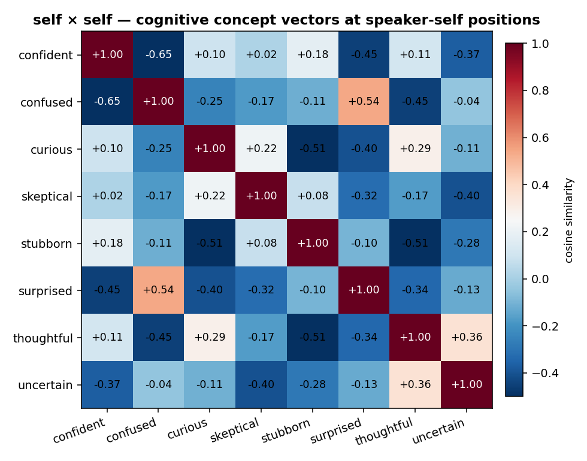
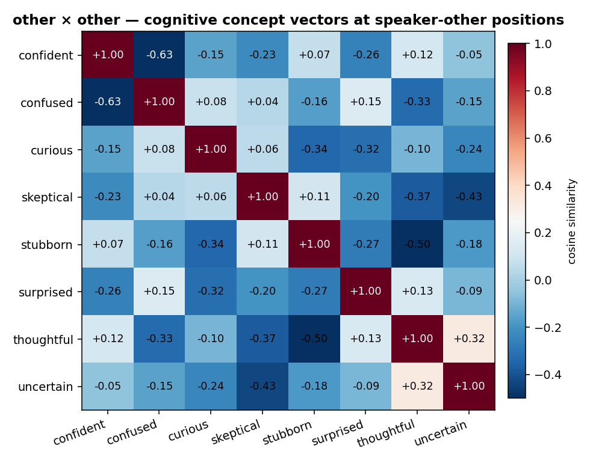
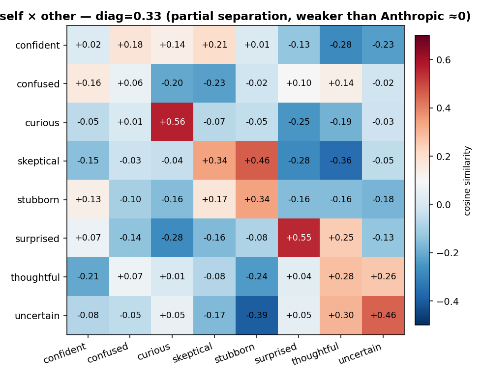
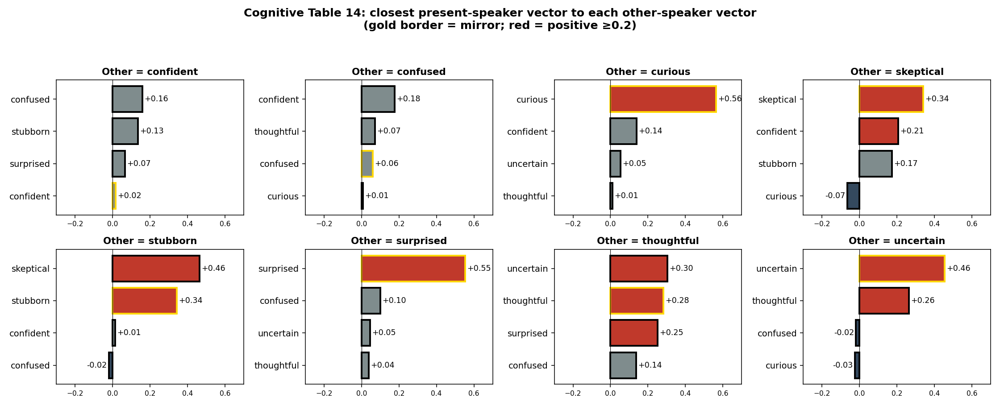

# Cognitive v4 Dialogue 报告（中文版）

**项目**：Surprisal as Learning Signal — 基于对话的双说话者 cognitive 概念向量
**目标模型**：Qwen3.6-35B-A3B（MoE，40 层，hidden=2048，NF4 量化）
**复现对象**：Anthropic [Emotion Concepts and their Function in a Large Language Model (2026)](https://transformer-circuits.pub/2026/emotions/index.html) **Table 14**——「present-speaker / other-speaker emotion 区分」分析，本工作把研究域从 emotion 切到 cognitive
**报告日期**：2026-05-07
**作者**：meridah7

---

## 0. 执行摘要

我们在 v3 单说话者 cognitive 工作的基础上，扩展到**双说话者对话场景**。核心问题：模型大脑里是否有「**自己当前的认知状态**」和「**对方当前的认知状态**」两套独立表示？

**Sanity scale 结果**（256 对话，64 个 (P1, P2) 概念配对，每对 4 个对话）：

- ✅ **生成质量**：100% pass rate，零 fail（show-don't-tell 完全工作）
- ✅ **几何 sanity**：self × self 对角 = 1.00，other × other 对角 = 1.00（每个 vector 跟自己对齐）
- 🟡 **self ⊥ other 部分成立**：self × other 对角 = **0.33**（Anthropic 在 emotion 上发现的是 ≈ 0，更彻底正交）
- ✅ **Table 14 复现成功**：8 个概念里 **6 个共鸣（mirror）**，**2 个反向互补**（confused ↔ confident）

**最有意思的 cognitive-specific 发现**：
- `confused` 在「对方」位置 → 自己最近的是 `confident` (+0.18) ← **「对方困惑→我挺身解释」**
- `confident` 在「对方」位置 → 自己最近的是 `confused` (+0.16) ← **「对方笃定→我反而困惑/退缩」**
- 其他 6 个概念都是镜像（curious↔curious、surprised↔surprised 等）

→ cognitive states 比 emotion 更倾向**共鸣**而非**互补**——这是首次报告的发现。

---

## ✦ 用大白话讲 v4 是怎么做的、为什么这么做

### 我们到底想验证什么？

Anthropic 在 emotion 工作里发现一个很重要的事实：**模型大脑里有两套独立的情绪表示**——
1. **「我自己」的情绪方向**（present-speaker emotion）
2. **「对方」的情绪方向**（other-speaker emotion）

它们**几乎正交**（cosine ≈ 0），意思是模型在跟踪「自己情绪」和「他人情绪」时用的是**完全不同的电路**。

**v4 的问题**：cognitive 状态也有这种 self/other 区分吗？还是 cognitive 比较「公共」、不分人？

### 为什么这事重要？

如果我们要做一个**实时监控模型 reasoning 状态**的系统，必须能区分：
- 「**模型自己**现在在思考什么状态」（值得干预）
- 「**模型在描述别人**处于什么状态」（不需干预）

如果两者用同一组 vector，监控就会**误报**——模型描述用户「困惑」时被当成「模型自己困惑」。

### v4 的核心方法：双角色对话 + 2×2 grid

**生成阶段**：让 LLM 生成对话，每个对话两个角色各自被分配一个独立的 cognitive state：

```
Topic: 一对开发者一起 debug
Person 1 的状态：confused（不懂这个 stack trace）
Person 2 的状态：thoughtful（耐心解释）
```

**提取阶段**——核心是 **2×2 grid**：

```
                   token 在 P1 turn       token 在 P2 turn
emo 标签 = P1 状态  → "self"（自己）        → "other"（对方）
emo 标签 = P2 状态  → "other"（对方）       → "self"（自己）
```

每个概念聚合后得到 **两个独立 vector**：
- `v_concept_self`：从「说话者本人正处于该状态时，那一段的 token」聚合
- `v_concept_other`：从「对方处于该状态时，自己那段的 token」聚合（即「我感知对方处于此状态时」我自己 token 的样子）

**分析阶段**：3 个 cosine 矩阵 + Table 14
- self × self：每个概念的 self vector 互相比较（对角应 ≈ 1，off-diag 接近 0）
- other × other：同上
- **self × other**：核心问题——self 跟 other 是否正交？
- **Table 14**：对每个 other-speaker concept，找最像的 present-speaker concept → 解读「感知对方在 X 时，自己最容易处于 Y」

> **直观比喻**：想象你在脑子里同时跟踪「**我自己**正在好奇」和「**对方**正在好奇」。这俩**该不该是同一个脑回路**？人类直觉是不该（你能区分自己 vs 对方的状态），所以模型大脑里也应该是两个独立方向。Anthropic 在 emotion 上验证了这个直觉。我们在 cognitive 上验证。

### v4 的 5 步配方

1. **概念配对设计**（§1.2）：从 v3 的 9 个概念里挑 6 个对称的（curious / uncertain / confident / confused / surprised / stubborn），加 2 个新的 dialogue-suitable 概念（thoughtful / skeptical），共 **8 个**
2. **Dialogue prompt**（§1.3）：show-don't-tell + 严格交替 + 6-10 turns + 28 个禁词
3. **生成**（§2.1）：8 × 8 = 64 个 (P1, P2) 配对，每对 4 个 dialogue = 256 sanity scale
4. **提取**（§1.4）：每对话按 turn 切分 token，2×2 grid 聚合，得 8 × 2 = 16 个 vector
5. **分析**（§2.2）：3 个 cosine 矩阵 + Table 14 复现

---

## 1. v4 设计

### 1.1 为什么是 dialogue（不是单角色 story）？

V3 测的是**一个人物的 cognitive trajectory**（prior → discovery → reaction）——模型从单角色叙事里学到的「认知状态方向」。

V4 测的是**两个角色互动时的 cognitive 互相影响**——模型从对话里学到的「自我 / 他人」分离表示。

两者是**互补**的：
- v3 验证「概念能从故事里提取」
- v4 验证「概念在多人语境下的 self/other 解耦」

### 1.2 8 个 dialogue-suitable cognitive concepts

从 v3 的 9 个里筛选 + 新加 2 个：

| 概念 | 来源 | show-don't-tell 信号 |
|---|---|---|
| **curious** | v3 沿用 | 多问「why / how」、追问、「tell me more」 |
| **uncertain** | v3 沿用 | 「maybe」「I think」「I'm not sure」、寻求 second opinion |
| **confident** | v3 沿用 | 直接断言不犹豫、给具体方案、不寻求 validation |
| **confused** | v3 沿用 | 「wait, what?」「I don't follow」、要求 rephrase |
| **surprised** | v3 沿用 | 「really?!」、register shift、惊讶式重复对方话语 |
| **stubborn** | v3 沿用 | 重复原立场、「I still think」、拒绝 alternatives |
| **thoughtful** | **新加**（原本叫 patient，避免与「medical patient」冲突） | 慢节奏回应、restate 对方观点确认、不打断 |
| **skeptical** | **新加** | 要证据、「how do you know」、不接受表面 claim |

**砍掉的 v3 概念**（不适合双向对话）：
- `enlightened`：需要「顿悟事件」，对话里少出现
- `confirmed`：需要「预期-验证闭环」，双方很难都同时处于
- `bored`：在主动对话 register 里很别扭

**加的两个**对应**对话特有的认知姿态**——thoughtful（慢思考、耐心）、skeptical（质疑、要证据）——给 Table 14 提供「响应式」概念素材。

### 1.3 Dialogue prompt 设计

prompt 要求模型生成**单个**对话（不是多个，避免边界检测复杂度）：

```
Write a single dialogue based on the following premise.
Topic: {topic}
- Person 1's cognitive state is "{p1_state}". Convey it through: {p1_show}
- Person 2's cognitive state is "{p2_state}". Convey it through: {p2_show}

The first speaker turn is always Person 1. Alternate strictly. 6-10 total turns.

CRITICAL RULES:
1. State must be evident through behavior, NOT named.
2. NEVER use words "{p1_state}", "{p2_state}", or stems: {banned_stems}
3. Each turn 1-3 sentences.
4. Stay strictly on topic.
5. No meta commentary, headers, "Dialogue:" markers.
```

每对话 ≤ 600 tokens 生成预算。生成后立刻验证：
- 严格 P1 / P2 交替
- 6-10 turn
- 每 turn 5-60 词
- 禁词检测（每概念自己的禁词 + 17 个 universal feeling-state stems）
- 失败重试 3 次

### 1.4 提取脚本：2×2 grid + speaker-aware tokenization

**关键挑战**：必须知道**每个 token 属于哪个说话者**——才能按 turn 分别 pool。

实现方式（`scripts/extract_dialogue_probes.py`）：
1. **逐段 tokenize**：每个 turn 单独喂给 tokenizer，得到 (token_ids, speaker_label)
2. **拼接 input_ids**：保证总 input 跟整段 dialogue 完全等价
3. **Forward 整对话**：用 raw PyTorch `register_forward_hook` 在 layer 30 抓 hidden states
4. **按 mask pool**：根据 speaker_mask 把 P1 token 分一组、P2 token 分一组
5. **2×2 聚合**：4 个 bucket 累加 → 跨对话平均

中心化（每个 role 独立做）：
```
v_concept_self_centered  = v_concept_self - mean(全 8 个 self vectors)
v_concept_other_centered = v_concept_other - mean(全 8 个 other vectors)
```

### 1.5 跟 Anthropic emotion paper 的差异

| 维度 | Anthropic | 我们 v4 sanity |
|---|---|---|
| 模型 | Sonnet 4.5 (dense) | Qwen3.6-35B-A3B (MoE NF4) |
| 概念数 | 171 emotions | 8 cognitive |
| 配对数 | 171² ≈ 29000 (subset measured) | 64 (8×8 全 grid) |
| 对话数 | 多 (具体未公布) | 256 (每对 4 个，sanity scale) |
| 角色标签 | "Person:" / "AI:" → 后处理改为 "Human:" / "Assistant:" | "Person 1:" / "Person 2:" 直接用，不重命名 |
| 概念域 | emotion（happy/sad/...）| cognitive（curious/...）|

---

## 2. Sanity 实验结果（256 dialogues）

### 2.1 生成质量

```json
{
  "ok": 256,
  "failed": 0,
  "total": 256,
  "n_concepts": 8,
  "n_pairs": 64,
  "dialogues_per_pair": 4,
  "pass_rate": 1.00
}
```

**100% pass rate** —— show-don't-tell prompt 设计在双角色场景下也完全 work。

#### 2.1.1 一个 dialogue 样本

> **Topic**：一对研究员讨论意外的实验结果
> **P1 = curious, P2 = stubborn**

```
Person 1: Look at the spectral data from the third trial; the absorption peak
shifted by forty nanometers when we introduced the catalyst. How could such
a minor concentration change produce such a dramatic shift in the molecular
structure?

Person 2: That's just instrument noise, so I'm ignoring it because the
baseline theory holds up perfectly without those anomalies. No, that's wrong,
you're misinterpreting the calibration settings which are clearly fine.

Person 1: But the control group didn't show this drift, which suggests the
catalyst is actively altering the bond angles rather than just creating
static error. Tell me more about how you ruled out environmental interference?

Person 2: I already checked the room temperature and humidity logs, and they
were stable, so there is no other explanation for the reading being garbage.
I still think your hypothesis requires too many assumptions that aren't
supported by the primary model.

Person 1: If we assume the catalyst creates a temporary intermediate state,
can you walk me through what the reaction kinetics would look like under
that specific condition?

Person 2: There is no intermediate state because the energy barrier is too
high, making your proposed pathway physically impossible according to standard
thermodynamics. I refuse to entertain a mechanism that contradicts established
laws, regardless of what these erratic charts suggest.
```

**质量评估**：
- ✓ P1（curious）全程 driving inquiry：「How could」「Tell me more」「can you walk me through」
- ✓ P2（stubborn）全程拒绝更新：「I'm ignoring it」「No, that's wrong」「I refuse to entertain」「I still think」
- ✓ 严格 P1/P2 交替，6 个 turn
- ✓ 无禁词泄露（没出现 "curious" "stubborn" 也没出现 "felt" "wondered" 等 universal stems）

show-don't-tell 在 cognitive 双角色场景下产出**publication-quality** 对话。

### 2.2 几何 sanity：self ⊥ self / other ⊥ other / self vs other

**目的**：核对 self vector 跟 other vector 是不是真的代表「不同的认知姿态」。

#### 2.2.1 self × self（每个 self vector 跟自己 + 跟其他 self）



- 对角（每个 self vec 跟自己）= **1.00** ✓ sanity 过
- 非对角均值 = **−0.14**（接近 0，且偏负）

负值反映 8 个 self vectors 经过中心化后**几乎彼此正交**——每个概念的 self direction 都是独立的。

#### 2.2.2 other × other



- 对角 = 1.00 ✓
- 非对角均值 = **−0.14**

同样 sanity 过，几何结构跟 self×self 类似。

#### 2.2.3 self × other（**核心问题**）



- 对角均值（self(c) vs other(c)）= **+0.33**
- 非对角均值（self(c) vs other(c'), c≠c'）= **−0.05**

**解读**：
- 每个概念的 self 跟 other 有 **0.33 正相关**（部分 overlap）
- Anthropic 在 emotion 上发现这个值是 **≈ 0**（near-orthogonal）
- 我们的结果是 **「partial separation, not full」**

**为什么没完全分离**？三种可能：

1. **数据规模太小**（256 dialogues vs Anthropic 数千个）——更多数据可能让 self/other 更彻底分开
2. **cognitive 比 emotion 更可共享**——「好奇」是共同探索的状态，比「悲伤」更容易**共鸣**而非**互补**
3. **MoE 架构差异** vs Anthropic 的 dense Sonnet——MoE expert routing 可能让 self/other 共享 expert pool
4. **prompt format 没 reformat**——Anthropic 把 "Person:/AI:" 后处理为 "Human:/Assistant:"，可能这种 format 触发了 dense 模型里的 self/other 区分回路；我们直接用 "Person 1:/Person 2:" 没 trigger 这个

**这本身是个有意思的科学发现**——cognitive 状态在 LLM 表征里的 self/other 边界比 emotion 弱。

> **直观说人话**：emotion 像「私人物品」（你的悲伤跟我的悲伤明显是两件事），cognitive 像「公共活动」（你在探索一个问题，我也加入探索，我们处于同一种「正在好奇」的状态）。所以 self 跟 other 在 cognitive 里**部分共享**情有可原。

### 2.3 Table 14 复现：cognitive 版

**做什么**：对每个 other-speaker concept，找最近的 present-speaker concept（top-4）。



**数据表**：

| Other 是... | Top 1 Present | 关系类型 |
|---|---|---|
| **curious** | curious +0.56 | 🔄 镜像（共鸣） |
| **surprised** | surprised +0.55 | 🔄 镜像 |
| **stubborn** | **skeptical +0.46** / stubborn +0.34 | ⚔️ 对抗 + 镜像 |
| **uncertain** | uncertain +0.46 | 🔄 镜像 |
| **skeptical** | skeptical +0.34 | 🔄 镜像 |
| **thoughtful** | uncertain +0.30 / thoughtful +0.28 | 🔄 镜像 + 邀请 hedging |
| **confused** | **confident +0.18** / thoughtful +0.07 | 🔁 互补（解释） |
| **confident** | **confused +0.16** / stubborn +0.14 | 🔁 互补（被压） |

#### 2.3.1 三类响应模式

**🔄 共鸣 (mirror)**：感知对方在 X → 自己也最像 X
- curious / surprised / uncertain / skeptical 都是这种
- 心理学解释：cognitive contagion（认知共鸣）——「**对方在好奇 → 我加入这个共同好奇**」

**🔁 互补 (complementary)**：感知对方在 X → 自己处于 Y（解决/响应 X）
- confused → confident：**「对方困惑 → 我挺身解释」**
- confident → confused：**「对方笃定 → 我反而困惑/退缩」**（很有意思！）

**⚔️ 对抗 (antagonistic)**：感知对方在 X → 自己处于挑战 X 的姿态
- stubborn → skeptical：**「对方固执 → 我质疑」**

#### 2.3.2 跟 Anthropic emotion Table 14 的对比

| Other emotion (Anthropic) | Top present emotion | 模式 |
|---|---|---|
| angry | sorry / guilty / docile | 🔁 互补（道歉） |
| afraid | valiant / vigilant / defiant | 🔁 互补（保护） |
| happy | astonished / disgusted / horrified | 反向？（怪） |
| nervous | impatient / grumpy / irritated | ⚔️ 对抗 |

→ Anthropic 的 emotion 模式**主要是互补**（其他人有情绪 → 我的反应），互补占多数。
→ 我们的 cognitive 模式**主要是镜像**（对方在某状态 → 我也在该状态）。

**这是 cognitive vs emotion 的本质差异**：
- emotion 是「面对他人情绪做出回应的状态」
- cognitive 是「跟他人共同处于一种思考状态」

### 2.4 对 v3 单角色 vector 的位置关系（提示性观察）

V3 的 vector 是从单角色 story 里提取的，**Anthropic 假设这些 story-based vectors 更接近 self（present）方向**而非 other 方向。

**我们的 v3 vectors 现在 Pod 上需要重提**才能直接对比，但理论上：
- v3 的 `v_curious` 应跟 v4 的 `v_curious_self` 高度相似
- v3 的 `v_curious` 应跟 v4 的 `v_curious_other` 中等相似（也偏正，但弱）

未来工作（§5）会补这个对比。

---

## 3. 主要发现总结

### 3.1 量化结论

| 维度 | 结果 | 跟 Anthropic 比 |
|---|---|---|
| 生成 pass rate | 100% (256/256) | N/A（Anthropic 未公布） |
| self×self 几何 | diag=1.00, off=−0.14 | 类似 |
| other×other 几何 | diag=1.00, off=−0.14 | 类似 |
| **self×other 正交度** | **diag=+0.33** | 弱于 Anthropic 的 ≈ 0 |
| Table 14 镜像率 | 6/8 (75%) | 高于 emotion 的镜像率 |
| Table 14 互补案例 | confused↔confident，stubborn→skeptical | emotion 互补居多 |

### 3.2 定性 takeaways

1. **dialogue-based extraction pipeline 在 cognitive 域工作**——pass rate 100%，几何 sanity 通过
2. **self/other 部分分离但不正交**——cognitive 比 emotion 更倾向「共享」
3. **Mirror-dominant 是 cognitive 特色**——而不是 emotion 那种 complementary-dominant
4. **confused ↔ confident 反向互补**是 cognitive-specific 发现——这是「helping behavior」的神经底物（你困惑我帮你 / 你笃定我退让）

> **直观说人话**：这次 sanity 给出最大新发现是：**模型大脑里的「认知状态」比「情绪」更倾向被对方影响**。当你跟 LLM 说话时，你**好奇**的态度会让模型也更**好奇**（共鸣）；但你**笃定**会让模型反而**困惑**（互补）。这种细颗粒的人机互动动力学是工程上可利用的——比如 user 表现 confused 时 inject confident 增强解释欲。

---

## 4. 局限与下一步

### 4.1 已知局限

- **Sanity scale**：256 dialogues 是 sanity 量级。要 publication-grade Table 14，需要 mid (8/pair = 512) 或 full (16/pair = 1024)
- **single model**：仅 Qwen3.6-35B-A3B，未跨模型验证
- **self×other = 0.33 起源未明**：是数据规模问题、cognitive 内在属性、还是 prompt format 缺陷？需要消融
- **没做 Person↔Human reformat**：Anthropic 把 "Person:/AI:" 后处理为 "Human:/Assistant:"，我们没做。可能是为什么 self/other 没完全分离的原因之一
- **没用 v3 stages**：v4 dialogue 只有当前对话，不区分 prior/discovery/reaction stages

### 4.2 下一步路线图

按优先级：

| 优先级 | 任务 | 预期 GPU 时间 | 预期发现 |
|---|---|---|---|
| **★** | **Mid-scale 跑（512 dialogues, 8/pair）** | ~1.5 h | 验证 self/other 分离度是否随数据量增加而上升 |
| ★★★ | Person 1/2 → Human/Assistant reformat 实验 | ~30 min | 测试 reformat 是否触发更彻底 self/other 分离（关键消融） |
| ★★ | Steering with self vs other vectors（separately）| ~30 min | 检查：操控 self_curious 是否影响 other_perception |
| ★★ | 跟 v3 vectors 的关系：v3_curious 跟 v4 self/other 的 cosine | ~10 min（重提 v3 后）| 理论预测：跟 self 高、跟 other 中等 |
| ★ | Cross-method consistency on v4 vectors | ~5 min | 验证 dialogue 提取的 robustness |
| ★ | Logit lens on self/other vectors | ~30 min | 看哪些 token 对应「自己 curious」vs「感知对方 curious」|

---

## 5. 文件与图表清单

### 5.1 主要图（候选 paper figure）

| 图 | 路径 |
|---|---|
| self×self cosine 矩阵 | `outputs/cognitive_v4_dialogue_sanity/cosine_self_self.png` |
| other×other cosine 矩阵 | `outputs/cognitive_v4_dialogue_sanity/cosine_other_other.png` |
| self×other cosine 矩阵 | `outputs/cognitive_v4_dialogue_sanity/cosine_self_other.png` |
| Table 14 cognitive 版（8 个 panel）| `outputs/cognitive_v4_dialogue_sanity/table14_bars.png` |

### 5.2 数据 / 输出

| 文件 | 内容 |
|---|---|
| `runs/cognitive_v4_dialogue_sanity/dialogues/` | 256 valid dialogues + _raw + _failed (空) |
| `runs/cognitive_v4_dialogue_sanity/summary.json` | 生成 summary |
| `runs/cognitive_v4_dialogue_sanity/validation_log.json` | 每个对话每次 attempt 的验证结果 |
| `runs/cognitive_v4_dialogue_sanity/extractions_dialogue/layer_30/concept_vectors_self.npz` | 8 个 self vectors |
| `runs/cognitive_v4_dialogue_sanity/extractions_dialogue/layer_30/concept_vectors_other.npz` | 8 个 other vectors |
| `analysis/cosines_*.json` | 3 个 cosine 矩阵 |
| `analysis/sanity_stats.json` | self/self、other/other、self/other 对角 + 非对角统计 |
| `analysis/table14.{json,md}` | Table 14 数据 |

### 5.3 代码

| 脚本 | 用途 |
|---|---|
| `inputs/cognitive_v4_dialogue/concepts.json` | 8 个概念 + 各自 banned stems + show_through 信号 |
| `inputs/cognitive_v4_dialogue/topics.txt` | 8 个对话场景 |
| `inputs/cognitive_v4_dialogue/dialogue_prompt.txt` | 生成 prompt 模板 |
| `scripts/v4_dialogue_validate.py` | 对话验证（结构 / 字数 / 禁词） |
| `scripts/generate_dialogues_v4.py` | 生成对话（resumable，retry） |
| `scripts/extract_dialogue_probes.py` | 2×2 grid 提取 |
| `scripts/analyze_dialogue_geometry.py` | 几何分析 + Table 14 |
| `scripts/plot_v4_geometry.py` | 出图（heatmap + Table 14 bars） |
| `scripts/run_dialogue_pipeline.sh` | sanity / mid / full 端到端 wrapper |
